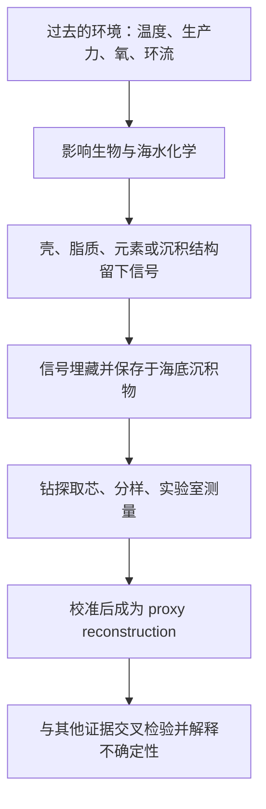
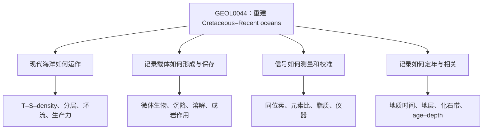

# UCL GEOL0044《Oceans, Life and Climate / Palaeoceanography》
## 零基础预科、软件训练、Reading 导读与开课后伴学体系（2026/27）

**检索截止日期：2026-09-04（UTC）**  
**对象：没有地球科学、海洋学、化学、生物学、编程或专业软件基础的学习者**

**导航**：Part 1 全景图｜Part 2 Knowledge Dependency Tree｜Part 3 学习优先级｜Part 4 Reading 导读｜Part 5 视频｜Part 6 Software Audit｜Part 7 软件教程｜Part 8 真实数据｜Part 9 Proxy/仪器链｜Part 10 时间轴｜Part 11 Bootcamp/开课后体系｜Part 12 术语表｜Part 13 首课达标

---

# Part 1　GEOL0044 到底在研究什么——给零基础学生的一幅全景图

## 1.1 先把课程事实与推断分开

UCL 的 [2026/27 Module Catalogue](https://www.ucl.ac.uk/module-catalogue/modules/palaeoceanography-GEOL0044) 明确写明：课程正式名称是 **Oceans, Life and Climate (GEOL0044)**，15 学分，由 Earth Sciences 开设，Term 1 面授；内容是现代海洋学基本原理、古海洋学代用指标（palaeoceanographic proxies，古海洋环境的间接指标）以及白垩纪至现代的海洋演化；考核公开为 40% exam、60% coursework；负责人是 Professor Bridget Wade。课程页于 2026-08-25 更新。

[Bridget Wade 的 UCL 官方页](https://www.ucl.ac.uk/mathematical-physical-sciences/earth-sciences/people/prof-bridget-wade) 显示，她是 micropalaeontology（微体古生物学）教授，研究用微体化石及其化学重建海温、pH、生产力、冰量、海平面、演化和灭绝。这个研究组合很好地解释了本课程为什么同时出现 foraminifera、nannofossils、stable isotopes、ocean circulation 和 Cenozoic climate。

目前公开证据的边界如下：

- **已确认**：主题范围、学习结果、Term 1、负责人、考核比例、面授形式。
- **未公开确认**：逐周 lecture titles、practical 次数和内容、显微镜是否亲手操作、软件、数据格式、module handbook、coursework 题型、每篇 reading 的必读状态。
- [ReadingLists@UCL 的 GEOL0044 模块页](https://ucl.rl.talis.com/modules/geol0044.html) 在检索日公开显示的仍是 **2025/26**；点入清单返回 403。因而本指南逐篇处理你截图可见的条目，但**目前没有公开证据确认它们构成 2026/27 完整书单**。
- Moodle lecture previews 要求 UCL 账户；任何无法公开进入的材料，本指南不补写、不猜测。

## 1.2 课程真正训练的是一条“证据链”

Palaeoceanography（古海洋学）不是背诵“过去很冷/很暖”。它问：**在没有温度计、CTD 和卫星的年代，我们如何从海底留下的物质推断当时的海洋？**

你需要形成三个反射动作：

1. 看到一条曲线，先问 **真正测量的是什么物质、什么单位**，不要先接受图题给出的环境解释。
2. 问 **为什么环境变量会改变这个可测信号**；这一步是 mechanism（机制）。
3. 问 **还有什么因素能产生同样变化**；这一步是 confounding factor（混淆因素）。

举例：foraminiferal δ¹⁸O 不是“温度计读数”。它是有孔虫碳酸钙壳相对于标准物的氧同位素比值；温度改变壳—水之间的 isotope fractionation（同位素分馏），大陆冰量又改变海水 δ¹⁸O，因此同一条 δ¹⁸O 曲线通常同时含有 temperature 与 ice volume 信息。

## 1.3 六个互相咬合的系统

- **海盆与构造**：plate tectonics（板块构造）制造海盆、海岭和 ocean gateways（海洋通道）；通道改变会重组环流。
- **现代海洋物理**：温度、盐度、压力决定密度和分层；风、浮力和混合驱动输运。古海洋解释必须从现代机制出发。
- **海洋生命与碳泵**：phytoplankton（浮游植物）把无机碳转成有机物；壳体生物制造 CaCO₃ 或 SiO₂；死亡后部分物质下沉。
- **沉积与保存**：产了多少、输了多少、溶了多少、埋了多少，共同决定岩芯里看到什么。absence（缺失）不自动等于当时没有生产。
- **地球化学**：同位素比值、元素比值、脂质分布和氧化还原敏感元素把过程转换成数字。
- **时间与相关**：stratigraphy（地层学）、biostratigraphy（生物地层学）和 age model（年龄模型）把不同岩芯放到共同时间轴上，才可以讨论先后和因果。

---

# Part 2　GEOL0044 Knowledge Dependency Tree

## 2.1 总依赖树

## 2.2 从课程目标反推先修层级

### 目标一：理解 ocean temperature and productivity

你必须先懂：

**温度、盐度和压力 → seawater density（海水密度） → stratification（分层）和 vertical mixing（垂向混合） → nutrient supply（营养盐供应） → phytoplankton growth（浮游植物生长） → export production（向深海输出的有机物） → 沉积记录。**

最低掌握深度：会读温度—深度、盐度—深度剖面；知道 thermocline（温跃层）、halocline（盐跃层）、pycnocline（密度跃层）；知道 nitrate/phosphate/silicate 是营养盐；能区分 primary productivity（单位时间产生的有机物）与 sedimentary organic carbon accumulation（沉积有机碳累积）。

不需预学：Navier–Stokes equations、湍流闭合、完整海洋动力学推导。Coriolis effect（科里奥利效应）和 Ekman transport（埃克曼输运）只需概念层面：地球自转使大尺度流动偏转，风应力可造成表层水辐散/辐合，从而产生 upwelling/downwelling（上升流/下沉流）。

### 目标二：理解 controls on biogenic sedimentation

依赖链是：

**谁生产壳 → 壳由什么组成 → 生产发生在哪里/何时 → 下沉途中发生什么 → 海底是否溶解或被稀释 → 埋藏后是否成岩改造。**

必须区分：

- pelagic sediment（远洋沉积物）：远离大陆、在开阔海沉积；不是一种固定成分。
- biogenic sediment（生物成因沉积物）：主要来自生物遗骸。
- carbonate ooze（碳酸盐软泥）：通常以有孔虫和钙质超微化石的 CaCO₃ 为主。
- siliceous ooze（硅质软泥）：以 diatoms（硅藻）或 radiolarians（放射虫）的生物硅为主。
- terrigenous sediment（陆源沉积物）：风、河流、冰川或浊流带来的陆地颗粒。

控制因素不是一个：surface production、water-depth dissolution、terrigenous dilution、sedimentation rate、winnowing/reworking、diagenesis 都会改变最后的含量。

### 目标三：理解 oceanic circulation 的发展与历史

先学现代词汇：surface circulation、deep ocean、water mass（水团）、overturning circulation（翻转环流）、deep-water formation（深水形成）、ventilation（通气/水团与表层交换）、upwelling、Southern Ocean。

核心机制：冷却和增盐通常提高密度；高纬表层水变密后可下沉，深水在盆地间流动并最终上返。风驱动与浮力驱动相互作用，不能把全球环流简化成一条匀速“传送带”。Atlantic Meridional Overturning Circulation (AMOC，大西洋经向翻转环流) 是区域系统，不等于全部 thermohaline circulation。

古海洋应用：gateway 的开闭、海盆几何、气候和淡水输入改变深水形成；benthic foraminiferal δ¹³C、δ¹⁸O 和 radiogenic isotopes（放射成因同位素）等记录水团性质及来源，但都不是“直接流速计”。

### 目标四：理解 analytical techniques 如何生产证据

依赖顺序是：

**样品代表性 → 前处理 → 仪器测量原始量 → blank/standard/QC → calibration → proxy → uncertainty。**

你要能回答“仪器实际测什么”，但不需要会维修仪器。对 IRMS，真正的仪器输出来自不同质量数离子的电流及其比值；对 ICP-MS，是元素离子的 mass-to-charge ratio 与信号强度；对 GC-MS/LC-MS，是先按化合物性质分离，再以质谱辨认/定量峰。

## 2.3 A：地球科学骨架

- **Earth structure（地球内部结构）**：只需 crust–mantle–core、lithosphere/asthenosphere；用于理解板块运动，不需矿物物理。
- **Plate tectonics**：必须会海底扩张、俯冲、被动/主动大陆边缘；它决定海盆年龄、深度和 gateways。
- **Ocean basins**：会看大陆架、陆坡、深海平原、中洋脊和海沟；不需海底地貌分类大全。
- **Geological time**：Ma = million years ago（距今百万年），ka = thousand years ago（距今千年）；Myr/kyr 表示持续时间时更清楚。BP 常以 1950 CE 为“present”，必须读数据说明。
- **Stratigraphy**：superposition（下老上新，未倒转时）、correlation（对比）、hiatus（沉积间断）、reworking（再搬运）。
- **Sedimentation rate**：单位常为 cm/kyr；近似为深度差/年龄差。速率变化意味着同样 1 cm 代表的时间不同。
- **Dating**：知道 radiometric dating、magnetostratigraphy、biostratigraphy、orbital tuning 的角色和限制；不需预先推导放射性衰变方程。

## 2.4 B：现代海洋过程为什么是古海洋解释的地基

温度、盐度、密度和压力共同定义 water mass。海洋表层接触大气，受热、蒸发、降水和风影响；深海光少、响应慢，但储存大量热、碳和营养盐。现代不同水团的温盐、氧、营养盐与同位素特征，提供 proxy calibration 和 process analogue（过程类比）。若不知道今天为何北大西洋深水富氧、老的北太平洋深水营养盐较高，就无法判断古老 benthic δ¹³C 差异可能表示什么。

生产力依赖光和营养盐。表层强分层可隔绝深层营养盐；上升流把 nitrate/phosphate/silicate 带到有光层，常提高生产力。Biological pump（生物泵）把表层固定的碳以颗粒/溶解形式向深海输送；大部分在途中 remineralisation（再矿化）回到 DIC，少部分埋藏。

## 2.5 C：生物与微体古生物从零开始

- **Plankton（浮游生物）**：主要随水漂移的生物统称，不等于“很小的植物”。
- **Phytoplankton（浮游植物）**：用光合作用获取能量并固定 CO₂；coccolithophores、diatoms 属此类。
- **Zooplankton（浮游动物性生物）**：摄食其他生物/颗粒；planktonic foraminifera 常按异养原生生物理解，部分有光合共生体。
- **Foraminifera（有孔虫）**：单细胞原生生物，通常有多室 test（壳）。许多壳是 calcite CaCO₃，也有 agglutinated（胶结颗粒）类型。planktonic foraminifera 生活于水柱上层不同深度；benthic foraminifera 在海底表面或浅层沉积物内，以碎屑、细菌等为食。死后壳下沉、可能溶解，幸存者进入沉积物。
- **Coccolithophores（颗石藻）**：光合 haptophyte algae（定鞭藻类），在透光层生活，细胞外有 calcite plates（coccoliths，颗石片）。化石 coccoliths/coccospheres 属 calcareous nannofossils（钙质超微化石），大量累积可形成 chalk。UCL 的 [nannofossil 介绍](https://www.ucl.ac.uk/GeolSci/micropal/calcnanno.html) 给出了这个关系。
- **Diatoms / radiolarians**：前者为光合藻类，后者为异养原生生物；都常形成 opaline silica（蛋白石质 SiO₂·nH₂O）骨架，是 siliceous ooze 的主要来源。

为什么能作 proxy：物种有生态偏好，壳的化学随环境变化，且壳可保存。为什么能作 biostratigraphy：演化较快、地理分布广、数量多的物种，其 first appearance/last appearance 可定义 biozones。但区域迁移、保存差、再搬运和识别误差会让“首次/末次出现”偏离真实演化时刻。

若有显微镜 practical（**目前未公开确认**），你可能看到：洗样后砂粒中的螺旋或球状有孔虫壳；双目体视镜下挑选单个 specimens；偏光显微镜下几微米大小、具有干涉色/消光图案的 nannofossils；SEM 图像中的孔、室、脊和表面结晶。第一目标不是背完物种，而是区分 planktonic/benthic、保存好/溶蚀、形态特征与样品污染。

## 2.6 D：碳酸盐、CCD 与海洋碳循环

海水碳酸盐体系的最小化学框架：

\[
CO_2 + H_2O \rightleftharpoons H_2CO_3 \rightleftharpoons H^+ + HCO_3^- \rightleftharpoons 2H^+ + CO_3^{2-}
\]

\[
Ca^{2+} + CO_3^{2-} \rightleftharpoons CaCO_3
\]

- DIC（dissolved inorganic carbon，溶解无机碳）约为 CO₂* + HCO₃⁻ + CO₃²⁻ 总量。
- Alkalinity（总碱度）是海水中和酸的能力，不等同于 DIC，也不是“pH 的另一种写法”。
- pH 是氢离子活度的负对数；pH 低一单位不是低一点，而约代表 H⁺ 增加十倍。
- Carbonate saturation state \(\Omega=[Ca^{2+}][CO_3^{2-}]/K_{sp}\)。\(\Omega<1\) 时热力学上更有利于溶解。
- lysocline（溶跃层）以下，碳酸盐溶解显著增强；carbonate compensation depth (CCD，碳酸盐补偿深度) 是 CaCO₃ supply/accumulation 与 dissolution 大致平衡的深度，再深通常没有净碳酸盐积累。

为什么一张“CCD 随时间变化”图能谈碳循环和水团：CCD 变浅可能表示深水 carbonate ion 降低、呼吸 CO₂ 增加、酸化增强或供给下降；变深可能表示保存改善、weathering/alkalinity 输入增加或供给提高。深水来源和年龄改变会改变 DIC/alkalinity/oxygen，从而改变饱和度。可是 CCD **不是直接 pH 计**：生产力、陆源稀释、盆地深度演化、重溶、钻孔覆盖和年龄模型也能移动重建的 CCD。

## 2.7 E：只补真正有用的化学

- atom（原子）由质子、中子、电子构成；element（元素）由质子数定义。
- ion（离子）带净电荷；例如 Ca²⁺、HCO₃⁻。
- isotope（同位素）质子数相同、中子数不同；因此化学行为近似但质量不同。
- atomic mass（原子质量）与 isotope abundance（同位素丰度）有关。
- mole（摩尔）是粒子计数单位；concentration（浓度）是单位体积/质量中的量，如 µmol kg⁻¹。
- acid/base（酸/碱）在本课只需理解 H⁺ 转移、pH 和碳酸盐平衡；不需完整有机化学。
- redox（氧化还原）是电子转移。oxic = 有氧；anoxic = 无氧；euxinic = 无氧且含游离硫化物。OAE 的黑色页岩、pyrite、organic carbon 和某些 trace-metal enrichments 都与此有关。

## 2.8 F：stable isotope geochemistry 的最低完整模型

Stable isotope（稳定同位素）不发生可观测时间尺度的放射性衰变。质量不同使反应、相变和扩散中轻重同位素分配略有差异，这叫 isotope fractionation。

令 \(R\) 为 heavy/light ratio，则：

\[
\delta = \left(\frac{R_{sample}}{R_{standard}}-1\right)\times1000\;\permil
\]

‰（per mil，千分率）表示相对标准每千份的偏差，不是百分数。carbonate 的 δ¹³C/δ¹⁸O 常报 VPDB；water 的 δ¹⁸O 常报 VSMOW。不同 scale 的数值不能不转换就直接比较。

**Foraminiferal δ¹⁸O 推理链**：低温通常使 calcite 相对水富集更多 ¹⁸O → 壳 δ¹⁸O 较高；冰盖生长优先把含 ¹⁶O 的水锁在陆地 → 海水 δ¹⁸O 上升 → 壳 δ¹⁸O 也上升。因此高 benthic δ¹⁸O 可能表示更冷、更大冰量或两者兼有。planktonic 壳反映其具体季节/深度的上层水；benthic 壳主要反映底水温度和全球海水同位素组成。还要考虑 species vital effects、salinity/δ¹⁸Owater、溶蚀、成岩和标准化。

**δ¹³C 推理链**：photosynthesis 偏好 ¹²C → 表层剩余 DIC 相对富 ¹³C；有机物下沉并再矿化，把低 δ¹³C 碳释放到深水 → 较“老”、营养盐高的深水常有较低 δ¹³C。benthic δ¹³C 可帮助比较水团/通气和全球碳循环，但会受生产力、气水交换、物种效应和碳酸盐离子影响。

## 2.9 图表与数学依赖

本课不需要为预习去学 calculus。必须会：scientific notation、单位换算、ratio、percent、per mil、mean、standard deviation、error bar、linear interpolation、correlation、简单 linear/exponential calibration、age–depth interpolation。Regression 与 confidence interval 先会解释意义，不必手算矩阵。

读任何 Earth Science 图时按固定顺序：

1. 标题、图注、数据来源；2. x/y 轴变量、单位和方向；3. 年龄是向左还是向右变老；4. depth 是否向下增大；5. 点是原始测量还是平滑/堆栈；6. 色标变量和范围；7. error/uncertainty；8. 同时变化只说明相关，不自动说明因果。

## 2.10 十种常见图到底怎样读

### Time-series graph（时间序列图）

先找时间变量是 calendar year、ka、Ma、age relative to event 还是 depth surrogate；再确认 old→young 方向。x 通常是 age/time，y 是 proxy measurement 或 reconstruction；点间距代表 sampling/resolution，线可能是 interpolation/smoothing。可以陈述趋势、excursion、幅度、持续范围和领先/滞后假说；没有 age uncertainty 与统计检验时，不能凭“峰对峰”证明同步或因果。

### Depth profile（深度剖面）

现代 ocean 图常以 y = depth，0 m 在上、深度向下；x 是 temperature、salinity、oxygen 或 nutrient。先找 mixed layer、跃层和深水近均一段，再比较 station/season。可以识别分层、水团性质或 nutrient regeneration 的形状；一条 profile 不能代表整个 ocean，也不能单凭相似数值唯一命名 water mass。

### Scatter plot / cross-plot（散点图/交会图）

x、y 都是测得/重建变量；每点可能是 sample、site 或时间窗。先看 units、点的分组/色彩、范围、离群点和是否存在非线性；再看 regression、r/r²、confidence band。可用于 calibration、mixing 或相关性；不能因高 r² 就证明 x 造成 y，尤其两者可能共享 age trend 或第三变量。

### Map（地图）

先确认 projection、latitude/longitude、现代还是 palaeogeography、点是 core sites 还是插值网格；color bar 是 SST、depth、isotope 还是 anomaly。可读空间梯度、coverage 和 gateway geometry；站点稀疏区域的平滑颜色不是直接观测，现代位置也不等于古位置。

### Ocean section（海洋断面图）

x 是沿航线 distance/latitude/longitude，y 是 depth/pressure，颜色是 temperature、salinity、oxygen 或 tracer；contours 可能是 density。先找 station positions、bathymetry 和 color scale，再找 property cores/tongues。可推断 water-mass pathways 和 mixing；它是一次/一段平均的切片，不能单独给出三维流速或因果方向。

### Stratigraphic column（地层柱状图）

y 常为 depth/height，通常老层在下、年轻层在上，但 core plots 也可能相反；旁列 lithology、fossil zone、TOC、δ¹³C 与 tie points。先找 hiatus、core recovery 与 unit boundaries。可读事件在层序中的相对先后；若无 age model，厚度不能直接当 duration，跨站同色层也不自动同时。

### Age–depth plot（年龄—深度图）

x/y 谁是 age 要看标签；data points 是 radiometric dates、magnetic reversals、bioevents、orbital tie points。连线/曲线就是 age model，斜率对应 sedimentation rate 的倒数或正比，取决于轴的放置。可在 tie points 间 interpolation；不能忽略 date error、reworking、hiatus，也不要在控制点外随意 extrapolate。

### Proxy stack（代理指标堆栈）

多个 site 的记录先对齐、标准化、校正物种/分辨率，再平均或拟合。先看 inclusion criteria、age model、normalisation、number of records 随时间变化和 uncertainty envelope。stack 可压低局地噪声、显示大尺度趋势；也会隐藏 basin difference，且共同 tuning target 会人为提高一致性。

### Isotope curve（同位素曲线）

先确认 δ¹⁸O 还是 δ¹³C、sample phase/species、VPDB/VSMOW、轴是否倒置。再区分 raw points、species-adjusted values 和 smooth/stack。可描述 excursion 与 gradients；不能跳过 water composition、ice volume、carbon-cycle background、vital effect 和 diagenesis 直接给单一环境答案。

### Species abundance plot（物种丰度图）

x 或色块是 relative abundance (%)、counts/g 或 accumulation rate，另一轴是 age/depth；先确认 denominator 和 size fraction。relative abundance 上升可能是该 species 增多，也可能是其他 species 减少或 selective dissolution。可讨论 assemblage turnover/ecological preference；没有总通量、保存与 taxonomy QC 时不能等同 absolute productivity。

## 2.11 够用的数学与统计：每项一个古海洋例子

- **Scientific notation（科学计数法）**：3.2×10⁻⁶ mol kg⁻¹ = 3.2 µmol kg⁻¹；先对齐 exponent 与 unit 再比较。
- **Logarithm（对数）**：pH = −log₁₀[H⁺]；pH 下降 1 表示 H⁺ activity 约增 10 倍。你只需会方向和数量级。
- **Ratio、percent、per mil（比率、百分比、千分率）**：50 个样中 10 个 species A 是 20%；δ = +2‰ 是 ratio 比标准约高 0.2%，不是 2%。
- **Mean 与 standard deviation（平均值与标准差）**：同一层 20 个 shells 的 Mg/Ca 平均描述中心，SD 描述壳间离散；样本 SD 不等于 instrument precision。
- **Linear interpolation（线性插值）**：100 cm = 50 ka、200 cm = 70 ka，则假设该段沉积率恒定时 150 cm = 60 ka；若有 hiatus 就失效。
- **Correlation（相关）**：δ¹³C 与 carbonate wt% 同步变化可提示共同过程，但也可能都受 dilution/age tuning 影响。
- **Linear/exponential regression（线性/指数回归）**：现代 core-top Mg/Ca 与 T 拟合 calibration；斜率/参数描述经验关系，residual 告诉你预测误差和遗漏变量。
- **Error bar 与 uncertainty（误差棒与不确定性）**：一根 reconstructed SST error bar 可能只含 analytical error，也可能含 calibration RMSE；若 caption 没说，不能自行解释成 95% confidence interval。
- **Confidence interval（置信区间）**：反复抽样构造区间的覆盖性质，不是“真值有 95% 概率在此”的通用简写；课程中先会比较区间和效应幅度。
- **Age uncertainty（年代不确定性）**：两个 proxy peaks 各 ±3 kyr 时，视觉上相差 2 kyr 不足以确立先后。把 x 轴不确定性与 y 轴 measurement/calibration uncertainty 分开。

---

# Part 3　“开课前必须会 / 上课过程中再学 / 可暂时不学”

## 开课前必须会

- Ma、ka、kyr、BP；Cretaceous、Paleogene、Neogene、Quaternary 的先后。
- 海盆地形、海底扩张、ocean gateway、sedimentation、stratigraphy、age model。
- temperature–salinity–density、分层、water mass、overturning、upwelling、productivity、biological pump。
- plankton/phytoplankton/zooplankton；planktonic vs benthic foraminifera；coccolithophore vs nannofossil；diatom/radiolarian。
- carbonate/siliceous/terrigenous sediment；lysocline、CCD、preservation/dissolution。
- atom、ion、isotope、ratio、pH、DIC、alkalinity、saturation、oxic/anoxic/euxinic。
- δ notation、‰、fractionation；能口头说出 foram δ¹⁸O 的 temperature–ice-volume ambiguity。
- 能在 spreadsheet 中导入 TSV/CSV、识别缺失值、排序、画 XY scatter/time series、反转 age axis、加单位与图例。
- 会读 profile、section、map、cross-plot、age–depth plot、proxy stack。

## 上课过程中再学

- 各 proxy 的具体 calibration coefficients、species-specific corrections、Bayesian calibration。
- Nd、Sr、Pb、Hf 等 long-lived isotopic tracers 的系统细节。
- OAE trace-metal systematics、clumped isotope Δ47 的标准化细节、TEX86 各版 index。
- 精细 nannofossil/foraminiferal taxonomy 和 biozone 名称。
- 具体仪器的质量控制、blank correction、reference material 与 inter-lab offsets。
- Cretaceous–Recent 各事件的争议机制；先掌握证据类别，再学学术争论。

## 可暂时不学

- 微积分、偏微分方程、完整流体力学推导。
- 全套无机/有机化学、量子化学、矿物晶体学。
- Python、R、MATLAB、QGIS；目前没有公开证据显示 GEOL0044 要求它们。**暂时不要学。**
- 海洋环流数值模型、GIS 制图、机器学习、复杂时间序列谱分析。
- 预先背诵全部 geologic stages、全部 microfossil species、全部仪器部件。

---

# Part 4　Reading List 逐篇拆解

## 4.1 使用说明与证据等级

下面的条目来自你提供的 2026/27 截图可见内容，并用出版社、论文 DOI、作者机构或数据仓库复核书目信息。由于公开 ReadingLists 正文无法进入，**Must read / useful / reference 是本指南为零基础学习路径设定的优先级，不是 UCL 官方标签**。Ruddiman 的 Essential/Recommended 仅按你的截图保留；具体版次、章节和 2026/27 清单完整性 unknown / not publicly confirmed。

每篇都用六栏叙述覆盖你要求的 15 个问题：①定位/为何出现/lecture theme；②先修、你现在可能缺什么、怎样补；③重点 figures/equations/terms；④最难处与首遍可跳过；⑤第一遍、第二遍、替代讲解；⑥难度和本指南优先级。

## 4.2 基础框架

### 1. W. F. Ruddiman, *Earth's Climate: Past and Future*

- **定位**：全课程的语言底座；对应 modern climate system、geological time、orbital forcing、ice ages、carbon cycle。它出现的理由不是让你逐章背书，而是让案例论文共享同一幅 Earth system 地图。
- **先修/补课**：只需先会 Ma/ka、latitude、energy balance、CO₂；你当前最需补的是 time scale、feedback、proxy 与 age model 的区别。
- **图、式、术语**：优先读辐射收支示意、CO₂/temperature 时间序列、Milankovitch orbital parameters、marine isotope stage 图。会解释趋势与相位；不必推导 radiative-transfer equations。术语：forcing、feedback、reservoir、flux、residence time、glacial/interglacial。
- **难点/跳读**：第一遍跳过模型参数、复杂能量方程、地区性细节；不要把旧版图中的年龄数值当最新标准。
- **两遍目标/替代**：首遍建立气候系统部件；第二遍专查 GEOL0044 案例涉及的章节并把每图写成“测量→解释→限制”。先看 Yale GG140 lectures 19–26。
- **难度/优先级**：2/5；**Must read（选读章节）**。确切版次和 UCL 指定页码目前无公开证据确认。

### 2. Roy Chester & Tim Jickells, *Marine Geochemistry*

- **定位**：DIC/alkalinity、nutrients、redox、sediment–water interaction 与 trace elements 的参考框架；对应 marine geochemistry 和 analytical techniques。
- **先修/补课**：先会 atom、ion、mole、concentration、pH、equilibrium；零化学背景者不要从第一页硬读全书，先完成本指南 Part 2.7。
- **图、式、术语**：会读 reservoir/flux box、vertical profiles、speciation diagrams、Eh–pH 概念图。质量守恒、浓度和简单平衡式要懂；复杂 thermodynamic derivations 可不做。术语：DIC、alkalinity、saturation、adsorption、remineralisation、diagenesis、oxic/anoxic/euxinic。
- **难点/跳读**：元素逐章细节、配位化学和热力学表最难；首遍只读海水组成、碳酸盐体系、营养盐、沉积与 redox。
- **两遍目标/替代**：首遍回答“海水中有哪些反应”；第二遍把 chemistry 接到 CCD/OAE/proxy。可先看 NOAA carbonate chemistry/WHOI ocean carbon 的公开材料。
- **难度/优先级**：4/5；**Reference**，不是开课前通读任务。书目具体版次在公开清单正文中未确认。

### 3. William W. Hay, “Paleoceanography: A review for the GSA Centennial”

- **定位**：解释古海洋学如何由 deep-sea coring、oxygen isotopes、plate tectonics 和 ocean drilling 成为学科；对应 course overview。[GSA 原文页](https://pubs.geoscienceworld.org/gsa/gsabulletin/article/100/12/1934/182099/Paleoceanography-A-review-for-the-GSA-Centennial)。
- **先修/补课**：海盆、沉积芯、δ¹⁸O、water mass 和地质时间。你最需补的是“测量技术改变了可问的问题”。
- **图、式、术语**：看 ocean-basin history、sediment distribution、circulation reconstruction；不需精算旧数据或背历史人名。术语：deep-sea core、DSDP/ODP、palaeogeography、overturning。
- **难点/跳读**：1988 年的学科状态和旧假说需历史化理解；首遍可跳过已被后续修正的细节。
- **两遍目标/替代**：首遍抓“证据来源的演化”；第二遍标出哪些问题后来由 Cramer/Pälike 等更新。没有比其更合适的短替代；先读摘要、图注和结论。
- **难度/优先级**：3/5；**Useful**。

## 4.3 微体化石与生物地层

### 4. P. R. Bown & J. R. Young, “Introduction”, in *Calcareous Nannofossil Biostratigraphy* (1998), pp. 1–15

- **定位**：给 nannofossil identification、taxonomy、ecology、preservation 和 biostratigraphy 建词汇；很可能支持显微图或化石带讨论，但 practical 未公开确认。
- **先修/补课**：phytoplankton、photosynthesis、CaCO₃、fossilisation、stratigraphic range。先看 UCL [Calcareous Nannofossils](https://www.ucl.ac.uk/GeolSci/micropal/calcnanno.html) 与 [Biostratigraphic Age Dating](https://www.ucl.ac.uk/mathematical-physical-sciences/earth-sciences/research-earth-sciences/research-groups-and-affiliated-institutes/micropalaeontology/about-ucl-micropalaeontology/nannoplankton/biostratigraphic-age-dating)。
- **图、式、术语**：重点是 coccolith/coccosphere 形态、light microscope/SEM、first/last appearance、biozone；无关键方程。
- **难点/跳读**：拉丁 taxon 名和精细分类最难；首遍跳过 species list、显微光学细节。
- **两遍目标/替代**：首遍能说 coccolithophore 与 nannofossil 的关系；第二遍理解为何 abundance、快速演化和广布能定年，同时列出 reworking/preservation/facies 偏差。
- **难度/优先级**：2/5；**Must read**。

### 5. P. R. Bown, J. A. Lees & J. R. Young, “Calcareous nannoplankton evolution and diversity through time”

- **定位**：把微体生物演化接到 Cretaceous–Recent climate/OAE/PETM；对应 nannoplankton evolution、biotic response。[Springer 书目与摘要](https://link.springer.com/chapter/10.1007/978-3-662-06278-4_18)；章节为 2004, pp. 481–508。
- **先修/补课**：species richness、speciation、extinction、turnover、sampling/preservation bias、地质时间。
- **图、式、术语**：优先 Fig. 1 phylogeny、Fig. 2 diversity through time、Fig. 3 extinction/speciation、Fig. 4 diversification/turnover。读懂每 3 Myr bin、rate 与 richness；不需推导统计量。
- **难点/跳读**：taxonomy screening、life-cycle dimorphism、oversplitting 偏差最难；首遍跳过全部 taxon 名，只标重大峰谷及 OAE/PETM/K–Pg。
- **两遍目标/替代**：首遍回答“多样性是否总在暖期上升”；第二遍区分真实 evolution 与 record bias。先读 [Palaeontology Online 的图文导读](https://www.palaeontologyonline.com/articles/2014/calcareous-nannofossils-best-things-microscopic/)。
- **难度/优先级**：3/5；**Must read**。

## 4.4 同位素、温度 proxy 与长期环流

### 6. B. S. Cramer et al., “Ocean overturning since the Late Cretaceous: Inferences from a new benthic foraminiferal isotope compilation”

- **定位**：课程目标“development/history of circulation”的核心案例；用跨海盆 benthic δ¹³C/δ¹⁸O 讨论深水结构。[论文 DOI](https://doi.org/10.1029/2008PA001683)，[PANGAEA 数据](https://doi.pangaea.de/10.1594/PANGAEA.890185)。
- **先修/补课**：benthic foram、δ notation、δ¹⁸O 的 temperature+ice、δ¹³C 的 carbon-cycle/water-age 含义、water mass、inter-basin gradient、age model。
- **图、式、术语**：先看 site map、按 ocean 分色的 isotope time series、smoothed/stacked curves 和 cross-basin offsets；理解 adjusted-to-Cibicidoides，不需复现 spline/统计处理。术语：benthic stack、basin gradient、overturning、Tethyan circulation、Southern Ocean source。
- **难点/跳读**：同一 isotope 差异有 water mass、global carbon cycle、species adjustment 多重来源；首遍跳 methods 的算法和逐站讨论。
- **两遍目标/替代**：首遍找 Late Cretaceous、EOT、Miocene 等重组；第二遍逐条写“数据支持/不能证明”。先看 Yale Lecture 26，再做 Part 8 练习 3。
- **难度/优先级**：5/5；**Must read（但放在 isotope 基础之后）**。

### 7. S. L. Goldstein & S. R. Hemming, “Long-lived Isotopic Tracers in Oceanography, Paleoceanography, and Ice-sheet Dynamics”

- **定位**：解释 Sr–Nd–Pb–Hf 等为什么能追踪 source/provenance 与 water masses；对应 long-lived tracers。书目信息：*Treatise on Geochemistry*, pp. 453–489，[DOI](https://doi.org/10.1016/B0-08-043751-6/06179-X)。
- **先修/补课**：先懂 stable vs radiogenic isotope、parent/daughter、continental weathering、hydrothermal input、water mass mixing。
- **图、式、术语**：重点看端元 mixing、εNd 地图、seawater ⁸⁷Sr/⁸⁶Sr curve、provenance plots；只需认 ratio/epsilon notation，不必推导 decay equations。
- **难点/跳读**：不同 isotope system 的 residence time、particle reactivity 和 boundary exchange 完全不同；首遍只读 Nd 与 Sr，Pb/Hf 留作参考。
- **两遍目标/替代**：首遍建立“tracer 追踪 source，不一定追踪 speed”；第二遍比较 authigenic coating、detrital fraction、fish debris 的载体与污染风险。
- **难度/优先级**：5/5；**Reference**。

### 8. John M. Eiler, “‘Clumped-isotope’ geochemistry—the study of naturally occurring, multiply substituted isotopologues”

- **定位**：展示新 proxy 如何从物理化学原理到 thermometry；对应 analytical innovation。[Caltech 作者存档](https://authors.library.caltech.edu/records/1znbn-d9004)，2007, *EPSL* 262, 309–327, [DOI](https://doi.org/10.1016/j.epsl.2007.08.020)。
- **先修/补课**：isotope、isotopologue、fractionation、equilibrium、mass spectrometry、conventional carbonate δ¹⁸O thermometry。
- **图、式、术语**：理解 rare heavy isotopes 在同一分子中“clump”超过随机分布，低温通常更多；认识 Δ47 与 calibration curve。不需推导 partition functions 或 stochastic abundance。
- **难点/跳读**：组合概率、thermodynamic notation、校正框架最难；首遍跳理论推导和非碳酸盐应用。
- **两遍目标/替代**：首遍回答“为什么它原则上不需要预先知道 water δ¹⁸O”；第二遍看 acid digestion、mass-47 measurement、standardisation、diagenetic reordering。
- **难度/优先级**：5/5；**Useful/advanced**。

### 9. J.-H. Kim et al., “New indices and calibrations derived from the distribution of crenarchaeal isoprenoid tetraether lipids...”

- **定位**：TEX86 如何由全球 core-top calibration 变成温度 proxy；对应 organic geochemistry 与 palaeotemperature。[论文 DOI](https://doi.org/10.1016/j.gca.2010.05.027)，2010, *GCA* 74, 4639–4654。
- **先修/补课**：archaea、cell membrane lipids、GDGT、chromatographic peak area、ratio/index、regression、RMSE。
- **图、式、术语**：重点看 sampling map、GDGT index vs SST scatter、residuals、不同 TEX86 calibrations；会把回归式代入温度，会解释 r² 和 calibration error，不需推导 lipid biosynthesis。
- **难点/跳读**：TEX86、TEX86H、TEX86L 多指数、subsurface production 与 polar/warm-end bias；首遍跳 analytical chromatography 细节和全部 index 比较。
- **两遍目标/替代**：首遍说清“LC-MS peak areas→index→core-top regression→SST”；第二遍问目标古环境是否落在 calibration domain 内、ecological depth/season 是否稳定。
- **难度/优先级**：5/5；**Must read 若该主题正式授课，否则 Useful**。

## 4.5 Cretaceous greenhouse 与 OAE

### 10. Takashima, Nishi, Huber & Leckie, “Greenhouse World and the Mesozoic Ocean”

- **定位**：进入 Cretaceous greenhouse 的地图和系统概览；对应 plate configuration、high sea level、warm climate、ocean chemistry、plankton。[Oceanography 开放文章](https://tos.org/oceanography/article/greenhouse-world-and-the-mesozoic-ocean)。
- **先修/补课**：plate tectonics、palaeogeographic map、greenhouse forcing、sea-level、stratification、OAE。
- **图、式、术语**：重点看 Mesozoic palaeogeography、temperature/CO₂/sea-level synthesis、Tethys 和新生 Atlantic；无关键推导。
- **难点/跳读**：构造、气候、生物和沉积的时间关系混在一起；首遍跳地区地层名。
- **两遍目标/替代**：首遍画出“火山/海底扩张—CO₂—温暖—风化/营养盐—缺氧”的假说链；第二遍逐箭头标 evidence 与 uncertainty。
- **难度/优先级**：3/5；**Must read**。

### 11. R. M. Leckie, T. J. Bralower & R. Cashman, “Oceanic anoxic events and plankton evolution...”

- **定位**：把 tectonic forcing、OAE black shale 与 plankton turnover 接起来；对应 mid-Cretaceous case study。[DOI](https://doi.org/10.1029/2001PA000623)。
- **先修/补课**：OAE1a/OAE2、black shale、anoxia/euxinia、δ¹³C excursion、forams/nannos、speciation/extinction。
- **图、式、术语**：看 stratigraphic columns、TOC/δ¹³C curves、taxon ranges、多阶段 conceptual model；通常无必须推导的方程。
- **难点/跳读**：global event 与 basin-local anoxia 的尺度差异、taxonomy 与 facies bias；首遍跳物种名单，保留 ecological guild 和 timing。
- **两遍目标/替代**：首遍回答“为什么高生产力既可增氧需求又可加强有机碳埋藏”；第二遍检查 tectonic forcing 是否是数据直接测得还是作者推断。
- **难度/优先级**：4/5；**Must read**。

### 12. Hugh C. Jenkyns, “Geochemistry of oceanic anoxic events”

- **定位**：OAE 的多 proxy 证据总成；对应 carbon cycle、redox、weathering、volcanism 和 analytical geochemistry。[AGU 全文页](https://agupubs.onlinelibrary.wiley.com/doi/full/10.1029/2009GC002788)。
- **先修/补课**：δ¹³C、TOC、redox、oxic/anoxic/euxinic、trace metals、S isotopes、weathering、TEX86。
- **图、式、术语**：优先 integrated stratigraphic panels 与 carbon-isotope excursions；认 TOC、Mo/U/V enrichment、pyrite、biomarkers、Os/Sr isotope 的证据类型。复杂 mass-balance 与 isotope-system 细节首遍不算。
- **难点/跳读**：proxy 众多且每个有局部/全球解释边界；首遍只做“proxy—测量对象—过程—歧义”表，跳逐地点综述。
- **两遍目标/替代**：首遍区分 anoxia 和 euxinia 的证据；第二遍比较 OAE1a、OAE2 是否同一机制，并辨认 carbon burial 造成正 δ¹³C excursion 的逻辑。
- **难度/优先级**：5/5；**Must read（第二阶段）**。

## 4.6 PETM、Cenozoic、CCD 与 Pliocene

### 13. A. Sluijs et al., “The Palaeocene–Eocene Thermal Maximum super greenhouse...”

- **定位**：PETM 的 biotic + geochemical + age-model 多证据案例；对应 rapid carbon release、warming、acidification、biotic response。[Geological Society 章节](https://pubs.geoscienceworld.org/gsl/books/edited-volume/1939/chapter/107595007/The-Palaeocene-Eocene-Thermal-Maximum-super)。
- **先修/补课**：negative carbon isotope excursion (CIE)、δ¹³C mass balance、δ¹⁸O/TEX86 temperature、CCD dissolution、benthic extinction、age model。
- **图、式、术语**：看不同 archive 的 CIE 对齐、temperature proxy、carbonate dissolution/CCD、microfossil turnover、age-model comparison。会读 warming 5–8 °C 这类范围；不需首遍解 carbon mass-balance equation。
- **难点/跳读**：事件起始时间、碳源质量/同位素组成/持续时间互相耦合；首遍跳每个 carbon-source scenario 的精确数值。
- **两遍目标/替代**：首遍建立“轻碳输入→negative CIE→warming→acidification/CCD shoaling→biota”；第二遍逐证据评估时间先后。先看 AMNH 8:11 PETM 视频，再做 Part 8 数据练习。
- **难度/优先级**：4/5；**Must read**。

### 14. H. Pälike, M. Lyle, H. Nishi et al., “A Cenozoic record of the equatorial Pacific carbonate compensation depth”

- **定位**：biogenic sedimentation、carbonate chemistry、ocean drilling 和 Cenozoic carbon cycle 的旗舰案例；对应 CCD。[Nature 书目/摘要](https://pubmed.ncbi.nlm.nih.gov/22932385)，[PANGAEA 数据](https://doi.pangaea.de/10.1594/PANGAEA.789572)。
- **先修/补课**：CaCO₃ accumulation、lysocline/CCD、palaeodepth、depth transect、carbonate saturation、weathering/alkalinity。
- **图、式、术语**：看 multiple-site depth transect、CaCO₃/MAR、reconstructed CCD time series 与 Eocene events。要理解 interpolation between sites、palaeodepth correction 和 mass accumulation rate；不必重建完整 age model。
- **难点/跳读**：观测的是不同水深站点的 carbonate accumulation，不是仪器直接测“CCD”；首遍跳船上 stratigraphic splice 技术。
- **两遍目标/替代**：首遍解释 CCD 53 Myr 的长期加深与叠加波动；第二遍列出 production、dissolution、dilution、tectonic subsidence 的竞争解释。
- **难度/优先级**：5/5；**Must read**。

### 15. A. C. Ravelo, P. S. Dekens & M. McCarthy, “Evidence for El Niño-like conditions during the Pliocene”

- **定位**：用多站点 SST/thermocline proxies 讨论 Pliocene tropical Pacific mean state；对应 proxy spatial comparison 与 ENSO analogue。2006, *GSA Today* 16, 4–11，[DOI](https://doi.org/10.1130/1052-5173(2006)016%3C4:EFENLC%3E2.0.CO;2)。
- **先修/补课**：现代 Walker circulation、east–west SST gradient、thermocline depth、El Niño 是 variability 而 “El Niño-like mean state” 是平均格局；Mg/Ca/alkenone/foram habitat 基础。
- **图、式、术语**：看 Pacific site map、东西 SST gradient、surface–thermocline gradient 和 proxy comparison；会读误差范围，不需推导 ocean model。
- **难点/跳读**：把一个长期平均态类比成短时 El Niño 容易过度；不同 proxy/物种记录不同季节和深度。首遍跳模型细节。
- **两遍目标/替代**：首遍说清作者证据；第二遍主动读后续反驳/更新，不把 2006 假说当定论。先看 Yale Lecture 23 的现代 ENSO 部分。
- **难度/优先级**：4/5；**Useful**。

## 4.7 冰期环流与千年尺度突变

### 16. Stefan Rahmstorf, “Thermohaline Ocean Circulation” / 截图标注的 glacial-climate 条目

- **定位**：现代机制到 glacial abrupt change 的桥；对应 deep-water formation、MOC/THC、freshwater forcing。[作者公开章节 PDF](https://courses.seas.harvard.edu/climate/eli/Courses/EPS281r/Sources/Thermohaline-circulation/1-Rahmstorf_EQS_2006.pdf)。公开可核实版本为 2006 *Encyclopedia of Quaternary Sciences* 条目；截图的精确题名/版次需以正式清单为准。
- **先修/补课**：T/S/density、pressure gradient、mixing、wind-driven vs buoyancy forcing、NADW/AABW、freshwater budget。
- **图、式、术语**：重点 Fig. 1 global schematic、Atlantic overturning side view、modern vs glacial circulation、hysteresis/threshold conceptual plots；无需求解 model equations。
- **难点/跳读**：THC 是 forcing concept，MOC 是可诊断 flow field，两者不是同义词；首遍跳数值模型参数和未来情景。
- **两遍目标/替代**：首遍说清 deep-water formation 与 global upwelling；第二遍解释 freshwater 为什么可能通过 salt-advection feedback 引起非线性响应。
- **难度/优先级**：3/5；**Must read**。

### 17. Sidney R. Hemming, “Heinrich events: Massive late Pleistocene detritus layers of the North Atlantic and their global climate imprint”

- **定位**：如何由一层粗碎屑重建 ice-sheet discharge、freshwater forcing 和 global teleconnection；对应 Late Pleistocene abrupt climate。2004, *Reviews of Geophysics* 42, RG1005，[DOI](https://doi.org/10.1029/2003RG000128)。
- **先修/补课**：ice-rafted debris (IRD)、Laurentide Ice Sheet、North Atlantic currents、AMOC、provenance、radiocarbon/age correlation。
- **图、式、术语**：看 core map/IRD belt、H1–H6 layers、grain/count time series、provenance tracers、inter-archive correlations；无核心方程。
- **难点/跳读**：层位是否同步、冰源判定、事件触发与气候响应的先后；首遍跳每个 mineral/isotope provenance system 细节。
- **两遍目标/替代**：首遍能从“coarse grains in deep sea”推到 iceberg rafting；第二遍区分 observation（IRD layer）、inference（ice-sheet surge）、hypothesis（AMOC change）。可先看 [GEOMAR 图解](https://www.geomar.de/en/research/fb1/fb1-p-oz/research-topics/low-to-high-latitude-climate-linkages/heinrich-events)。
- **难度/优先级**：4/5；**Must read**。

### 18. Gerard Bond, “Millennial Climate Variability”

- **定位**：把 Heinrich/Dansgaard–Oeschger/Bond-type variability 放入 millennial-scale 框架；对应 timescale 与 abruptness。[Springer 条目](https://link.springer.com/rwe/10.1007/978-1-4020-4411-3_142)，pp. 568–573。
- **先修/补课**：time-series resolution、age uncertainty、correlation、ice-core vs marine-core archives、AMOC。
- **图、式、术语**：看 proxy alignment、event numbering、phase/lag；无需方程，但要问 sampling interval 是否足以分辨千年事件。
- **难点/跳读**：不同 archive 的 age models 会制造或模糊同步性；首遍可跳周期成因争论。
- **两遍目标/替代**：首遍区分 millennial variability 和 orbital glacial cycles；第二遍检查“周期性”是否超出 dating/resolution 能力。
- **难度/优先级**：3/5；**Useful**。

## 4.8 建议的知识依赖顺序

1. Ruddiman 选读 → Chester & Jickells 选读：建立现代 ocean–climate–chemistry。
2. Bown & Young Introduction → Bown, Lees & Young：建立壳、生物地层与演化。
3. Hay：理解古海洋证据来自 cores、fossils、chemistry 和 drilling。
4. Rahmstorf：先懂现代/冰期 overturning。
5. Cramer：再读 benthic isotope compilation。
6. Goldstein & Hemming：把“source tracer”加到 water-mass 解释；先 Nd/Sr。
7. Kim → Eiler：分别掌握 organic proxy calibration 与 clumped-isotope thermometry。
8. Takashima et al.：进入 Cretaceous greenhouse 全景。
9. Leckie et al. → Jenkyns：从生物响应到 geochemical synthesis。
10. Sluijs et al.：PETM 多 proxy 案例。
11. Pälike et al.：Cenozoic CCD 与 carbon cycle。
12. Ravelo et al.：Pliocene Pacific spatial proxy test。
13. Hemming → Bond：从可见 IRD 层到 millennial climate framework。

这个顺序把“现代过程”放在“过去解释”之前，把“载体/测量”放在“事件故事”之前，能避免把 proxy 名称当结论背诵。

---

# Part 5　高质量视频和大学公开课

## 5.1 核心观看路径

这里宁可少而可靠。每个条目都说明看哪一段、对应什么、看后应能回答什么。时长以课程页、视频页或当前索引显示为准；YouTube 在不同地区可能受限。没有核验到合格资源的 niche topic 会明确标为“未找到”，不会造链接。

### 1. 现代海洋的空间框架

**“Ocean Bathymetry and Water Properties” — Prof. Ron Smith, Yale University, Open Yale Courses, 约 50 min。**  
[课程页与分章时间](https://oyc.yale.edu/geology-and-geophysics/gg-140/lecture-19)；难度 1–2/5。重点看 17:12–37:37：海底地形、三大洋、surface water properties；若时间够再看 37:37 后的 deep-water measurement。对应 ocean basins、surface/deep ocean、temperature/salinity。前置只需经纬度。看完应能回答：为什么地形和 gateway 会约束环流？为何表层和深层数据采样不同？**值得完整看，plate-tectonic 复习可快进。**

### 2. 温度—盐度—密度—分层

**“Ocean Water Density and Atmospheric Forcing” — Prof. Ron Smith, Yale University, 约 50 min。**  
[课程页与分章时间](https://oyc.yale.edu/geology-and-geophysics/gg-140/lecture-20)；难度 2/5。核心 0:00–22:08（profiles、salinity、stability、density），再看 22:08–43:23（热、降水/蒸发、风应力）。对应 thermocline/halocline/pycnocline、surface forcing。前置：会读 x–y graph。看后应能解释“冷和咸为什么通常更密”及“为什么稳定分层抑制混合”。**值得完整看。**

### 3. overturning、deep-water formation、upwelling 与 productivity

**“Ocean Currents and Productivity” — Prof. Ron Smith, Yale University, 约 50 min。**  
[课程页与分章时间](https://oyc.yale.edu/geology-and-geophysics/gg-140/lecture-22)；难度 2–3/5。看 0:00–31:45 的 currents/transport/basins，再看 31:45–结束的 productivity。前置：完成上一个视频。看后应能回答：upwelling 为什么常提高生产力？Atlantic/Pacific/Southern Ocean 在翻转中各扮演什么角色？**完整看。** 若要补 thermohaline 的定义，Lecture 21 从 [29:38](https://oyc.yale.edu/geology-and-geophysics/gg-140/lecture-21) 开始看至结束。

零基础动画补充：NOAA **“The Global Conveyor Belt”**（网页短动画/图文，作者署名 NOAA Ocean Service，约 5–10 min 阅读）[链接](https://oceanservice.noaa.gov/education/tutorial_currents/05conveyor1.html)。难度 1/5；用于先建空间直觉，但之后要用 Rahmstorf 修正“单一传送带”的过度简化。

### 4. Marine sediments、biogenic sedimentation 与 CCD

**“13 – Deep sea sediments” — Prof. Matthew E. Clapham, University of California Santa Cruz, 14:41。**  
[视频](https://www.youtube.com/watch?v=g-RMtaqWH5Q)；难度 2/5；完整观看。对应 calcareous/siliceous ooze、carbonate saturation、lysocline、CCD。前置：知道 CaCO₃、foram、nannofossil。看后应能解释为什么 carbonate production 在表层而 dissolution 主要决定深海保存，以及为什么“深海无碳酸盐”不等于表层无钙化生物。

### 5. Foraminifera：壳如何记录冰量与气候

零基础：**“These tiny shells know how much ice there is on Earth” — MinuteEarth, 2:50。**  
[视频](https://www.youtube.com/watch?v=oaOfeSJZ3lY)；难度 1/5；完整看。对应 foraminifera、δ¹⁸O 与 ice volume。前置无。看后应能说出“冰盖优先储存 ¹⁶O”的方向，但不要以此替代温度分馏的完整解释。

进阶：**“Naturally Speaking – Planktic Foraminifera and Climate Change” — Dr Adriane Lam, Virginia Living Museum, 43 min。**  
[可访问课程页/视频入口](https://www.classcentral.com/course/youtube-naturally-speaking-dr-adriane-lam-312725)；难度 3/5；建议完整看，若时间少看前 15 min 的生物/记录基础和后半的分布、演化、biostratigraphy 案例。前置：geological time、plankton。看后应能解释 species range 为什么能定年又为什么会因迁移失真。

### 6. Coccolithophores、calcareous nannofossils 与 biostratigraphy

进阶：**“Chapter II – Episode V – Orbital cycles, climates and Coccolithophores” — Dr Luc Beaufort, Aix-Marseille University / NannoTalks, 26:04。**  
[视频](https://www.youtube.com/watch?v=OKxCw1MO0Gs)；难度 4/5；先看 0–10 min 的对象与方法，完成 Bown Introduction 后再完整看。对应 coccolith abundance/morphology、orbital cycles、climate。前置：coccolith/coccosphere、orbital forcing。看后应能区分“物种出现/消失用于定年”和“assemblage/morphology 用于环境解释”。

**零基础视频缺口**：在优先机构中未核验到一支同时短、准确、从 coccolithophore 讲到 nannofossil/biostratigraphy 的公开课。先用 UCL 的 [图文介绍](https://www.ucl.ac.uk/GeolSci/micropal/calcnanno.html)（约 15 min）替代，不用低质量视频填空。

### 7. Stable isotopes、δ notation、fractionation、δ¹⁸O/δ¹³C

**“Isotope Evidence for Climate Change” — Prof. Ron Smith, Yale University, 约 50 min。**  
[课程页与分章时间](https://oyc.yale.edu/geology-and-geophysics/gg-140/lecture-26)；难度 2–3/5。必看 0:00–18:08（stable isotopes、delta、fractionation）和 31:14–44:08（terrestrial/deep-sea sediment、ocean-core oxygen isotopes）；ice-core 段可第二遍看。前置：atom/isotope、ratio。看后应能写 δ 公式、解释 ‰、说出 foram δ¹⁸O 的三项控制：temperature、ice volume、seawater composition。**值得完整看两遍。**

### 8. Mass spectrometry / IRMS

零基础：**“Mass spectrometry” — Khan Academy, 4:18。**  
[视频](https://www.khanacademy.org/science/chemistry/atomic-structure-and-properties/mass-spectrometry/v/mass-spectrometry)；讲者为 Khan Academy 教学团队；难度 1/5；完整看。对应 ionisation、按 mass 分离、mass spectrum。看后应能说 x 轴为什么是 mass-to-charge、y 轴为什么是 signal intensity。

进阶：**“Elementar at the BGS Stable Isotope Facility” — Dr Andi Smith, British Geological Survey / Elementar, 39 min。**  
[webinar 页面](https://www.elementar.com/en/balancing-the-nitrogen-cycle/dr-andi-smith-elementar-uk-irms-user-meeting-keynote)；难度 4/5；看前 15 min 的 facility/sample-to-instrument 流程和出现 standards/QC 的部分，暂不必完整看应用细节。前置：δ notation。看后应能说出 IRMS 为什么要 sample gas、reference gas、standards 和重复测量。更直接的仪器链可配合 [PNNL IRMS 原理页](https://www.emsl.pnnl.gov/science/instruments-resources/isotope-ratio-mass-spectrometry) 阅读。

### 9. Mg/Ca、TEX86、UK'37 与 clumped isotopes

经过检索，**没有核验到同时满足“公开可访问、机构/大学来源、从零讲、时长明确”的单项视频组合**。因此不提供貌似精确但无法核实的链接。用下面三份短机构/作者材料做 reading scaffold：

- Mg/Ca：GEOMAR [Mg/Ca Paleothermometry Laboratory](https://www.geomar.de/en/research/fb1/fb1-p-oz/infrastructure/mgca-paleothermometry-laboratory)，约 10 min；看后回答“为什么 foram calcite 的 Mg/Ca 随温度变、用什么仪器测”。
- TEX86：先读 Kim et al. 摘要和本指南 Part 9；看 sampling map 与 calibration scatter 后再读正文。
- Clumped isotopes：Caltech **“Earth's Vital Signs”**，John Eiler 访谈/文字稿 [链接](https://thelonelyidea.caltech.edu/episode-6-john-eiler-caltech-podcast)，约一集播客长度；难度 2/5，先听/读解释部分，再读 Eiler 2007。它不是仪器教程，但能回答“为什么同一分子中重同位素结对与温度有关”。

### 10. Oceanic Anoxic Events (OAE)

零基础补充：**“Continental Rearrangement Affects Ocean Chemistry & May Cause Ocean Anoxic Events!” — GEO GIRL, 19:01。**  
[视频](https://www.youtube.com/watch?v=G_T7xYu6Smc)；讲者/频道 GEO GIRL，难度 2/5；完整看。它不属于优先大学来源，因此只作入口。看后应能画出 plate rearrangement–weathering/nutrients–productivity–oxygen demand–anoxia 链，并指出每个箭头仍需证据。

大学水平替代不是另一支视频，而是 Jenkyns 的 [2010 AGU review](https://agupubs.onlinelibrary.wiley.com/doi/full/10.1029/2009GC002788) 配合本指南 Part 9 的 redox analytical chain。公开视频检索未发现一支比这篇综述更适合本模块的、时长和讲者都可核验的大学 lecture。

### 11. PETM

**“PETM: Unearthing Ancient Climate Change” — American Museum of Natural History, 8:11。**  
[视频](https://www.amnh.org/explore/videos/earth-and-climate/paleocene-eocene-thermal-maximum)；讲者为 AMNH 科研/教育团队，难度 1–2/5；完整看。前置：CO₂、δ¹³C、fossil。看后应能回答事件约何时发生、温度和生物发生什么、海洋沉积物留下什么；然后用 Sluijs 阅读补 negative CIE、acidification 与 timing。

### 12. Cenozoic circulation 与 Antarctic ice

**“Cenozoic global climate and Antarctic Ice Sheet history: A brief journey” — Dr Adrián López-Quirós, Universidad de Granada / Museo Nacional de Ciencias Naturales (CSIC), 约 60 min。**  
[视频](https://www.youtube.com/watch?v=-FFpXlMAXBc)；[机构活动页](https://www.mncn.csic.es/es/seminarios-2025)；难度 4/5。先看开头至 Eocene–Oligocene transition，再按需要看 Miocene/Pliocene；前置是 Cenozoic 时间轴、δ¹⁸O。看后应能把 EECO、EOT、Mi-1、MMCO、early Pliocene 按顺序放到 ocean–ice–circulation 框架。**强化版值得完整看，最低版只看片段。**

### 13. Heinrich events 与 millennial variability

**“Ice–Ocean Interactions and Heinrich Events” — Prof. Richard B. Alley, Pennsylvania State University / AGU, 约 18:33。**  
[视频](https://www.youtube.com/watch?v=1cg2-kpKLhk)；难度 4/5；前 5 min 建对象，余下看 ice-sheet/ocean feedback；前置：IRD、AMOC、Last Glacial Period。看后应能把 observation（IRD layer）与 mechanism hypothesis（ice-sheet surge/freshwater/AMOC）分开。建议先读 GEOMAR 图解，再完整看。

### 14. Modern ENSO → Pliocene “El Niño-like” hypothesis

**“El Niño” — Prof. Ron Smith, Yale University, 约 50 min。**  
[课程页与分章时间](https://oyc.yale.edu/geology-and-geophysics/gg-140/lecture-23)；难度 2/5；看 0:00–39:45，后面的 ice material 可停。对应 Walker circulation、thermocline、indices、spatial anomaly。前置：surface winds/upwelling。看后应能区分 event、variability、mean state；再读 Ravelo 时问“长期 Pliocene gradient 变小是否等于持续 El Niño”。

**Pliocene-specific 视频缺口**：未核验到 Ravelo/Dekens/McCarthy 这篇证据链的可靠开放 lecture。因为这个解释后来有持续讨论，用现代 ENSO lecture + 原论文 + 后续反思，比一个泛科普视频更稳妥。

## 5.2 不要怎样用视频

视频只负责建立动态直觉，不替代图注和 methods。每看完一个视频，强制写三句：**它真正观测什么？机制是什么？还有什么替代解释？** 如果写不出，说明只是“看过”，还没有转成 GEOL0044 能用的知识。

---

# Part 6　Software Audit

## 6.1 结论：最小软件栈

**A. Confirmed for GEOL0044：无。** 截至检索日，UCL 公开 Module Catalogue、Earth Sciences 页面和可进入的 ReadingLists landing page 均未列出软件；practical 内容也未公开。任何人若声称课程“一定用 ODV/Python/R”，都超出了公开证据。

**B. Highly relevant / likely useful：**

1. **Excel 或 Google Sheets（二选一）**：用于 age–depth、δ¹⁸O/δ¹³C、Mg/Ca、species abundance 等表格数据的导入、清理和作图。不是因为课程确认使用，而是因为它能以最低学习成本消除数据 practical 的通用障碍。
2. **webODV**：不用安装、不用下载大数据，适合练 temperature/salinity/depth、T–S plot 和 ocean section。[ODV 官方](https://odv.awi.de/) 明确说明 webODV Explore 可在线分析环境数据。
3. **Desktop Ocean Data View (ODV)**：只有完成 webODV 后仍想练 import/export 或课程后来确认使用时再装。当前官方版为 **5.8.6（2026-06-13）**，Windows/macOS/Linux 可用，教学和非商业研究免费但下载需注册。

**C. Optional extension：**

- **Python 3.14.7 stable + Jupyter/pandas/matplotlib**：可重复的大数据处理很有价值，但 [Python 官网](https://www.python.org/downloads/) 显示 3.15 尚为 prerelease；GEOL0044 无公开要求。**暂时不要学。**
- **R 4.6.1 + RStudio Desktop 2026.08.2**：统计和 publication-quality graphics 很强；版本见 [R Project](https://www.r-project.org/) 与 [Posit 文档](https://docs.posit.co/ide/user/)。课程未确认。**暂时不要学。**
- **Panoply 5.10.1（2026-08-02）**：NASA GISS 的 netCDF/HDF/GRIB viewer，[官方页](https://www.giss.nasa.gov/tools/panoply/)。只有老师发 netCDF 时才装；它不替代 ODV 的站位/profile 工作流。
- **QGIS**：地图与空间分析；当前官网 roadmap 显示 latest 4.2.2、LTR 3.44.14（版本会月更），但本模块无 GIS 需求证据。**暂时不要学。**
- **Fiji/ImageJ**：显微图测量；Fiji 是 portable rolling build，官方 latest archive 当前为 2026-07-18，[下载页](https://imagej.net/software/fiji/downloads)。只有 practical 要量 shell size/area 时才用。
- **MATLAB**：无公开要求；付费、启动成本高。**不要为本课预学。**

## 6.2 为什么不是“全装上再说”

软件不是先修知识。你真正缺的是判断 x/y/colour 分别代表什么、单位能否比较、missing value 如何处理、time/depth axis 方向是否合理。Spreadsheet + webODV 足以训练这些 transferable skills；等正式 practical sheet 出现，再按证据升级。

---

# Part 7　软件安装和第一次使用教程

## 7.1 Excel / Google Sheets（二选一）

1. **GEOL0044 是否确认使用**：否；目前没有公开证据确认。
2. **为什么仍值得学**：绝大多数开放 palaeo 数据提供 CSV/TSV/TXT；基础筛选、公式、XY plot 足够完成第一层解释。
3. **解决什么问题**：导入表格、识别缺失值、单位换算、排序、年龄—proxy 作图、两变量比较。
4. **典型数据**：sample depth、age、δ¹⁸O、δ¹³C、Mg/Ca、SST、species counts/relative abundance。
5. **对应主题**：所有 proxy time series、age model、Cramer/Pälike/Sluijs/Ravelo readings。
6. **格式**：CSV（逗号）、TSV/tab-delimited TXT（制表符）、XLSX。netCDF 不是 spreadsheet 原生工作对象。
7. **地址**：[Microsoft Excel](https://www.microsoft.com/microsoft-365/excel)；[Google Sheets](https://docs.google.com/spreadsheets/)。
8. **版本**：Microsoft 365 是持续更新服务，没有一个跨平台统一“2026 版号”；Sheets 是浏览器服务。
9. **Windows**：已有 Microsoft 365 就从 Office/Microsoft 365 安装器选择 Excel；否则直接用 Sheets。
10. **macOS**：从 Microsoft 365 或 Mac App Store 安装 Excel；否则 Safari/Chrome 打开 Sheets。
11. **浏览器版**：Excel for web 和 Google Sheets 都有。
12. **账户**：桌面 Excel 激活通常需 Microsoft 账户/许可；Sheets 需 Google 账户；Excel web 需 Microsoft 账户。
13. **费用**：Sheets 免费；Excel web 有免费功能，完整桌面版取决于 UCL/个人许可证。
14. **第一次点哪里**：Excel `Data > From Text/CSV`；Sheets `File > Import > Upload`。不要双击 CSV 就假定 delimiter、decimal 和日期全正确。
15. **30–60 min tutorial**：用 Part 8 练习 2；前 15 min 导入/清理，20 min 作两条曲线，10 min 标事件，10 min 写解释与限制。
16–17. **真实练习/数据**：Zachos et al. ODP Site 1262 δ¹³C/δ¹⁸O，[PANGAEA DOI](https://doi.pangaea.de/10.1594/PANGAEA.756583)。
18. **逐步输入**：见 Part 8；核心公式例如 `=Age_rel/1000` 把 ka 转 Myr，注意这只是单位换算，不是绝对年龄模型。
19–23. **最终图和科学意义**：两幅共用 x 轴的 time-series；x = relative age (ka)，y 分别 = bulk-carbonate δ¹³C、δ¹⁸O (‰ PDB)。最大 negative CIE 是碳循环扰动；δ¹⁸O 同变可能含温度/成分/成岩信息，不能直接当温度。
24. **保存/export**：保留原始数据 sheet；另建 `clean` 和 `figures`；保存 XLSX，再 export PNG/PDF；另存一份 CSV 会丢公式和图。
25. **常见错误**：把 line chart 的类别轴当数值轴、Excel 自动把 sample code 变日期、忽略 ‰/%、把空白当 0、双 y 轴夸大相关、没写单位、把 relative age 当 absolute Ma。

## 7.2 webODV（先用）与 Desktop ODV（后装）

1. **GEOL0044 是否确认使用**：否。
2. **为什么值得学**：课程明确涉及 ocean temperature/productivity/circulation，而 ODV 能让你亲眼看到现代 ocean profiles、sections 和 property–property plots。
3. **解决什么问题**：探索带经纬度和深度的 oceanographic profiles、cruise sections、time series 与 gridded fields。
4. **典型数据**：CTD temperature/salinity/pressure、oxygen、nutrients、DIC、tracers；它不是专门的 palaeo age-series 软件。
5. **对应主题**：water masses、deep-water formation、upwelling、thermocline、modern calibration context。
6. **格式**：webODV 数据已托管；desktop ODV 可 import ODV spreadsheet、ASCII、WOCE formats、合规 netCDF/OPeNDAP。官方说明见 [ODV 首页](https://odv.awi.de/)。
7. **地址**：[webODV Explore](https://explore.webodv.awi.de/)；[desktop download](https://odv.awi.de/software/download/)。
8. **版本**：desktop 5.8.6；webODV 为服务，不用自行选版本。
9. **Windows 安装**：注册 non-commercial account → 登录 download page → 选 Windows installer → 按安装向导 → 首次启动允许创建 user settings。
10. **macOS 安装**：同样注册/下载对应 Intel 或 Apple Silicon build；拖入 Applications/按安装包提示。webODV 在 macOS 必须先在 `System Settings > Trackpad/Mouse` 启用 Secondary click；官方文档明确说 Ctrl-click 不等同右键。
11. **浏览器版**：有，推荐先用；Chrome/Firefox/Safari/Edge，Internet Explorer 不支持。
12. **账户**：公开 webODV Explore 无需账户；desktop 下载需注册；登录 webODV 才能跨浏览器持久保存 private views。
13. **费用**：教学/非商业研究免费；商业/军事使用需相应许可。
14. **第一次点哪里**：Explore 页展开 `Ocean > woa23 > 1.00-degree > 01_all-years > 01_annual > WOA23_1.00deg_all-years_annual`；进数据后先 `View > Load View` 选择 prepared view。鼠标悬停变量名看 metadata；点 station/sample 后右侧显示 metadata/data。
15. **30–60 min tutorial**：Part 8 练习 1；官方 7 页 [ODV-online Getting Started](https://odv.awi.de/fileadmin/user_upload/odv/docs/ODV-online_getting_started.pdf) 是准确伴读。
16–17. **真实练习/数据**：NOAA World Ocean Atlas 2023 (WOA23)，webODV 已托管；[NOAA 数据说明](https://www.ncei.noaa.gov/products/world-ocean-atlas)。
18. **逐步操作**：见 Part 8；核心是 `View > Load View`、右击 plot `Properties`、右击 canvas `Layout > Create New Window`、右击 map `Manage Section`。
19. **最终图**：temperature–depth、salinity–depth、T–S scatter、Atlantic/Southern Ocean section。
20. **x 轴**：profile 图为 temperature (°C) 或 salinity；T–S 图 x 常为 salinity；section x 为 section distance/longitude/latitude。
21. **y 轴**：profile/section 为 depth (m) 或 pressure (dbar)，通常向下增加；T–S 图 y 为 potential temperature (°C)。
22. **colour scale**：可用 depth、potential density 或 temperature；色标不是第三种“装饰”，必须写变量/单位。
23. **科学意义**：vertical gradients 显示分层；T–S clusters/curves 帮助辨认水团混合；section 展示水团空间结构。WOA 是 climatology，不能当某一天的观测。
24. **保存/export**：右击白色 canvas/plot/map → `Save Canvas As / Save Plot As / Save Map As`；`Export` 可导 ASCII spreadsheet、ODV collection 或 netCDF；`View > Save View As` 保存配置。
25. **常见错误**：macOS 右键未启用；把 pressure 当精确 depth；把 gridded interpolation 当原始点；用 rainbow 色标遮蔽结构；没有看 QC flag；session 闲置 60 min 终止；清浏览器数据后 private settings 消失。

---

# Part 8　真实数据练习

## 8.1 练习一：用 webODV 从现代海洋理解 water masses（45–60 min）

**数据**：NOAA [World Ocean Atlas 2023](https://www.ncei.noaa.gov/products/world-ocean-atlas)，webODV 中选择 1° annual climatology。WOA23 包含质量控制后的 temperature、salinity、oxygen、phosphate、silicate、nitrate 等气候态场。

### A. 打开并读 metadata（5 min）

1. 打开 [webODV Explore](https://explore.webodv.awi.de/)。
2. 依次展开 `Ocean > woa23 > 1.00-degree > 01_all-years > 01_annual`，点 `WOA23_1.00deg_all-years_annual`。
3. 鼠标悬停 collection title 和右侧 variable names；进入 `Collection` menu 看 dataset description。
4. 写下：这是 climatology 还是 raw cruise？空间分辨率？annual 还是 monthly？temperature/salinity 单位？missing/QC 信息？

### B. Temperature–depth 与 salinity–depth profiles（15 min）

1. 在 map 上选北大西洋约 50–60°N、20–40°W 的 grid station；按 `+` 加入 pick list。
2. `View > Load View` 先找现成 profile view；若无，右击白色 canvas → `Layout > Create New Window > STATION`。
3. 右击新窗口 → `Properties`：x 选 temperature，y 选 depth/pressure；Apply。再建一个窗口 x 选 salinity、y 同上。
4. 若深度向上增加，右击窗口 `Properties` 调整 y-range/axis direction，使 0 m 在上、深水在下。
5. 再选热带 Atlantic 和 Southern Ocean 各一站加入 pick list。比较 mixed layer、thermocline、deep values。

**应得到**：x 为 °C 或 salinity，y 为 m/dbar；近表层变化大、深海较均一。不要仅凭一条 profile 给水团命名；先比较地点、深度和两个变量。

### C. T–S diagram（10 min）

1. 新建 `SCATTER` window；Properties：x = salinity，y = potential temperature（若只有 in-situ temperature，先用它但注明）。
2. z/colour 选 depth 或 potential density；Apply。
3. 观察不同站点是否沿混合曲线排列。若可定义 derived variable：`View > Derived Variables` 加 potential density/sigma0，再以其着色。

**科学解释**：相似 T–S 特征帮助追踪 water mass；两端元混合常形成连接线/曲线。温盐相近不证明同一来源，age/tracer/oxygen 仍可不同。

### D. Ocean section（15–20 min）

1. 右击 station map → `Manage Section > Define Section`。
2. 在 Atlantic 从约 60°S 沿西/中大西洋点到 60°N；转折处多点，双击末点或 Enter。
3. 在 Section Properties 选 distance 或 latitude coordinate、合适 width，Apply。
4. 新建 `SECTION` window：x = section distance/latitude，y = depth，z/colour = temperature；复制一窗改为 salinity。
5. 右击窗口可选 gridding；若使用 DIVA/weighted averaging，必须把图称为“由观测估算的连续场”，不是每个像素都有测量。

**应能解释**：冷、较淡/较咸的深层舌状体与盆地间梯度暗示水团来源和混合；真正命名 NADW、AABW、AAIW 前，要看该区域的标准 hydrography 和 density/oxygen/tracer 证据。

### E. Export（5 min）

右击各窗 `Save Plot As` 输出 PNG；`Export > Window Data` 导 ASCII spreadsheet；保存 view 为 `GEOL0044_WOA23_TS_section`。交一页 lab note：图、三条 observation、两条 interpretation、一条 uncertainty。

## 8.2 练习二：PETM 周边 δ¹³C/δ¹⁸O time series（Excel/Sheets，45–60 min）

**真实数据**：Zachos et al. (2010), ODP Site 208-1262, Walvis Ridge，10,864 个数据点；landing page 给出经纬度、4755.4 m 水深、depth/mcd/relative age、bulk-carbonate δ¹³C 和 δ¹⁸O、mass spectrometry 方法及原论文 DOI。[数据与 metadata](https://doi.pangaea.de/10.1594/PANGAEA.756583)。注意：这不是 foram-specific isotope 数据，而是 **bulk carbonate**。

### A. Download 与导入（10 min）

1. 在 landing page 先读 `Coverage / Event(s) / Parameter(s) / Method / License`，再点 `Download dataset as tab-delimited text`。
2. Excel：`Data > From Text/CSV`，delimiter 选 Tab、encoding 选 UTF-8；若预览含 metadata preamble，在 Power Query 删除顶部说明行，直到真正 column headers，再 Load。Sheets：`File > Import > Upload`，separator 选 Tab；若不能自动略过说明，先在文本编辑器找到 data header 行后复制数据区到新 sheet。
3. 原始 sheet 命名 `raw_DO_NOT_EDIT`，复制到 `clean`。

### B. 清理（10 min）

1. 保留 Sample label、Depth sed (m)、Depth comp (mcd)、Age rel (ka)、Comment、δ13C carb (‰ PDB)、δ18O carb (‰ PDB)。
2. 把空白、NaN 或质量标记保留为空，不替换为 0。
3. 用筛选检查数值列是否被读成 text；必要时 `VALUE()` 转换。按 Age rel 数值排序。
4. 新建 `Age_rel_Myr = Age_rel_ka/1000`。强调：它仍是相对年龄，不是 56 Ma 这类绝对年龄。

### C. 作图（15 min）

1. Insert → **XY Scatter with lines**，不是普通 Line chart。
2. 图 1：x = Age rel (ka)，y = δ¹³C carb (‰ VPDB/PDB)；图 2：相同 x，y = δ¹⁸O carb。
3. 两图 x-range 完全一致并上下排列。只有当你明确采用“old left / young right”或相反约定时才反转 x；在 caption 写明方向。
4. 用 Comment 列、论文 Figure 2 或显著 negative CIE 定位 PETM/其他 hyperthermals；加垂直标线，别凭肉眼猜绝对年龄。

### D. 解释（10–15 min）

- **Observation**：写 excursion 的方向、幅度、持续范围和恢复形态；不要先写原因。
- **Mechanism hypothesis**：negative δ¹³C excursion 表示系统加入/重新分配了相对 ¹³C 贫化的碳；温室气体增加可导致 warming 和 carbonate saturation 下降。
- **Cross-proxy**：比较 δ¹³C minima 与 δ¹⁸O、Fe/carbonate dissolution（landing page 摘要指出多数 CIE 的 δ¹³C minima 对应 Fe peaks）。
- **Uncertainty**：bulk carbonate 物种/矿物组成变化、diagenesis、age model、sampling resolution、orbital tuning、δ¹⁸O 的温度/水组成混合。

**不得得出的结论**：仅凭 bulk δ¹⁸O 一列直接换算精确 SST；仅凭两曲线同变证明某个碳源；把相对年龄列当绝对年龄。

## 8.3 练习三：Cramer benthic isotope compilation（可选 60 min）

从 [PANGAEA dataset 890185](https://doi.pangaea.de/10.1594/PANGAEA.890185) 下载；它有 430,497 个数据点、两套 age model、raw/adjusted δ¹³C/δ¹⁸O、ocean/site/species/palaeowaterdepth。Spreadsheet 可打开但较大；不开 Python。

1. 先 filter 一个 ocean 和 1–3 个 site；不要一开始画全部点。
2. 选同一 age model，`Age_Ma=Age_ka/1000`；x = Age Ma，y = adjusted δ¹³C；用 ocean/site 分色。
3. 第二窗画 adjusted δ¹⁸O；把 geological time 设为 old→young 并明确 x 轴方向。
4. 找不同 basin 的 offset 是否长期存在/何时改变；这才是 circulation inference 的入口。
5. 写出三项限制：species adjustment、uneven site coverage/resolution、age-model differences；再加 diagenesis 与 global carbon-cycle overprint。

## 8.4 如何使用真正的数据库

### PANGAEA

[PANGAEA](https://www.pangaea.de/) 是 Earth & Environmental Science data publisher。搜索时用 `topic + site + proxy`，如 `PETM Site 1262 carbon isotope`。Landing page 先看：citation/DOI → related paper → coverage/location → event/cruise/core → parameters/units/method → license → download。

- **DOI**：持久标识符；引用数据集本身，不只引用论文。
- **Metadata**：解释数据谁、何时、何地、如何获得、单位/方法/许可；没有 metadata 的数字几乎不可解释。
- **Site/core number**：例如 ODP `208-1262` 表示 Leg 208 的 Site 1262；一个 Site 可有多个 Holes（A/B/C），多孔拼接形成 composite depth。
- **Latitude/longitude**：负纬度为南，负经度为西；还要区分 present location 与 palaeolocation。
- **Age model**：把 core depth 转成 age 的规则/控制点/插值；不是原始仪器读数。
- **适合分析的判断**：目标时间段覆盖、时间分辨率够、单位/标准清楚、方法/物种一致、age model 可追溯、missing/QC 可识别、许可允许使用、能找到对应 paper。

### NOAA/NCEI Paleoclimatology / Paleoceanography

[NOAA Paleoceanography](https://www.ncei.noaa.gov/products/paleoclimatology/paleoceanography) 可按 investigator、title、location、parameter、lat/lon 搜索，含 fossil plankton isotope/trace metal/species/lithology 及 CLIMAP、MARGO、SPECMAP 等项目。搜索结果先进入 study metadata，再下载 data file；README/header 里的 column definition、missing value、chronology 比图本身更重要。注意 NCEI 正在迁移云服务，临时访问延迟不等于数据不存在。

### IODP/ODP drilling databases

[LORE](https://iodp.tamu.edu/LORE/) 保存 Expeditions 320 以后 LIMS measurements；较早 ODP/DSDP 常需 Janus 或 expedition proceedings。检索逻辑：Expedition → Site → Hole → Core → Section → interval。一个 sample label 如 `1262A-10H-3, 50–52 cm` 是取样地址，不是年龄；必须通过 splice/age model 转换。先找 core description、lithology、physical properties、core images，再找派生 proxy。

### Mikrotax / Nannotax / pforams@mikrotax

[Mikrotax](https://www.mikrotax.org/) 是微体化石 taxonomy 系统入口；[pforams](https://www.mikrotax.org/pforams/) 查 planktonic foraminifera，[Nannotax](https://www.mikrotax.org/Nannotax3/) 查 calcareous nannoplankton。用 genus/species 搜索后，依次看：accepted name/synonyms → age range → morphology → SEM/light-microscope views → ecology/biogeography → references。不要只对“长得像”的一张图命名；要同时用 chamber arrangement、aperture、wall texture、size 与多个视角。

**第一次检索任务**：在 pforams 搜 *Neogloboquadrina pachyderma*，记录现代水温/纬度偏好与 shell view；在 Nannotax 搜 *Coccolithus pelagicus*，记录 coccolith/coccosphere 图、age range 和 synonyms。然后各写一句“为何能作 environmental indicator”和一句“为何不是绝对温度计”。

---

# Part 9　Proxy + Analytical Technique Map

## 9.1 一张必须内化的证据生产图

~~~mermaid
flowchart TD
    A["Environmental property 温度、生产力、水团、氧化还原"] --> B["Physical / biological response 分馏、生长、物种分布、矿物形成"]
    B --> C["Measurable signal 同位素、元素比、有机分子、群落组成"]
    C --> D["Archive 壳体、沉积物、有机质、冰筏碎屑"]
    D --> E["Core recovery and sampling"]
    E --> F["Preparation and instrument"]
    F --> G["Raw numerical measurement"]
    G --> H["Calibration and age model"]
    H --> I["Reconstructed variable"]
    I --> J["Palaeoceanographic interpretation"]
    J --> K["Uncertainty and alternatives"]
~~~

Proxy（代用指标）不是“过去环境本身”，而是对过去环境敏感、能保存、能测量，并经 calibration（校准）转换的信号。每次看到论文曲线，都问四次：测的是谁？由什么机制产生？怎样从原始数变成环境量？还有什么因素能产生同样信号？

## 9.2 五种 palaeotemperature proxies 的统一十问

### 1. Oxygen-isotope palaeothermometry：foraminiferal δ¹⁸O

1. **测什么？** 有孔虫方解石壳中 ¹⁸O/¹⁶O，以 δ¹⁸O（‰，通常相对 VPDB）表达。
2. **样品来自什么？** 沉积岩芯中挑出的单种 planktonic foraminifera（浮游有孔虫）或 benthic foraminifera（底栖有孔虫）壳体；前者偏表层/次表层，后者偏海底水。
3. **仪器原始量是什么？** 清洗壳体与磷酸反应释放 CO₂；isotope-ratio mass spectrometer（IRMS，同位素比质谱仪）比较不同质量数 CO₂ 离子束的强度，求样品/标准同位素比。
4. **为何与温度有关？** CaCO₃ 与水之间的 oxygen-isotope fractionation（氧同位素分馏）随温度改变；低温通常使壳体相对富集 ¹⁸O。
5. **怎样转成温度？** 把壳体 δ¹⁸O 与估计的 seawater δ¹⁸O 一起代入经验/热力学校准方程；所以它不是只凭一列 shell δ¹⁸O 就能得到温度。
6. **Calibration 是什么？** 用现代培养、core-top 或已知温度样品拟合“温度—壳水分馏”的关系，并明确物种、标准与方程适用范围。
7. **典型图？** x = age（ka/Ma）或 core depth；y = δ¹⁸O（‰ VPDB）。有时 y 轴倒置，使“暖”朝上；必须读图注。
8. **最大不确定性？** seawater δ¹⁸O 同时受 global ice volume、盐度/水循环与水团来源影响；另有 species vital effects、栖息深度、季节、溶解、成岩与 age model。
9. **对应 reading？** Cramer et al. 的 benthic compilation、Sluijs et al. 的 PETM、Ruddiman；具体课堂使用范围仍以 Moodle 为准。
10. **数学要求？** 比率、‰、符号方向、代入一元校准、误差传播的概念；不需微积分。

完整推理是：温度与水体 δ¹⁸O → 改变方解石—水分馏 → 有孔虫生长壳体 → 壳体下沉/埋藏 → 挑样清洗 → 磷酸释放 CO₂ → IRMS 测比值 → 相对 VPDB 算 δ¹⁸O → 校准 → 温度/冰量解释 → 用 Mg/Ca、物种和独立 ice-volume 约束拆开混合因素。

### 2. Mg/Ca palaeothermometry

1. **测什么？** 有孔虫方解石中的 magnesium/calcium ratio（Mg/Ca，通常 mmol/mol）。
2. **样品？** 挑出的单种、相近壳体大小和保存状态的浮游或底栖有孔虫。
3. **原始量？** 壳体严格清洗、溶酸；ICP-OES 或 ICP-MS 测 Mg 与 Ca 的发射强度/离子计数，再算元素比。
4. **为何与温度有关？** 方解石形成时 Mg 进入晶格的分配对温度敏感，通常温度越高 Mg/Ca 越高。
5. **怎样转温度？** 常用近似指数关系 Mg/Ca = B·exp(A·T)，取对数或用软件反解 T。
6. **Calibration？** 现代 core-top、sediment-trap 或 culture 数据，将已知水温与特定物种 Mg/Ca 拟合；物种和清洗方法不能随便混用。
7. **典型图？** Mg/Ca 或 reconstructed SST 随 age；也常把 Mg/Ca-SST 与 δ¹⁸O 并列，以估算 seawater δ¹⁸O/ice volume。
8. **最大不确定性？** dissolution 会优先改变富 Mg 部分；黏土/氧化物污染、清洗损失、species vital effect、pH、carbonate ion、过去 seawater Mg/Ca 变化。
9. **对应 reading？** 用户截图可见清单没有一篇标题专门针对 Mg/Ca；它是课程目标中的典型温度 proxy，但 **目前没有公开证据确认具体指定篇目或 practical**。
10. **数学？** 指数/对数、回归校准和单位；会用 spreadsheet 公式即可。

### 3. TEX₈₆

1. **测什么？** archaeal GDGT membrane lipids（古菌 GDGT 膜脂）不同结构的相对丰度所组成的 TEX₈₆ index。
2. **样品？** 含沉积有机质的海底沉积物；不是有孔虫壳。
3. **原始量？** 溶剂萃取、分离极性组分；HPLC/LC-MS 测各 GDGT 分子的 chromatographic peak area（色谱峰面积）与质量信号。
4. **为何与温度有关？** 产 GDGT 的海洋古菌会随生长温度调整膜脂环化程度，以维持膜性质。
5. **怎样转温度？** 先由峰面积计算 TEX₈₆ 或派生 index，再用现代 surface-sediment/global calibration 转成 SST 或 subsurface temperature。
6. **Calibration？** Kim et al. 用全球现代沉积物和观测温度建立新 index/calibration；训练时必须看 calibration dataset、拟合形式和 residual。
7. **典型图？** index 或 reconstructed SST 随 age；方法论文还会画 index vs modern SST scatter 与 residual map。
8. **最大不确定性？** 生产深度/季节并非固定，archaea ecology、terrestrial input、氧化降解、非热源 GDGT、古代环境超出现代校准范围。
9. **对应 reading？** Kim, van der Meer, Schouten et al.；难点正是从分子峰面积到校准温度的两级转换。
10. **数学？** 比率指数、log/非线性回归的图意、RMSE；不要求自己推导模型。

### 4. Uᵏ′₃₇ / alkenone palaeothermometry

1. **测什么？** 长链 alkenones 中 C₃₇:₂ 与 C₃₇:₃ 的相对丰度，常写 Uᵏ′₃₇ = C₃₇:₂/(C₃₇:₂+C₃₇:₃)。
2. **样品？** 某些 haptophyte algae（定鞭藻，含部分 coccolithophore）产生、后保存于沉积有机质的 alkenones。
3. **原始量？** 溶剂萃取后用 gas chromatography（GC）或 GC-MS 分离；测两个化合物峰面积。
4. **为何与温度有关？** 产脂藻类随生长温度改变 alkenone 不饱和度。
5. **怎样转温度？** 计算 index，再用 culture/core-top calibration 转 SST。
6. **Calibration？** 已知现代 SST 与 surface-sediment index 的回归；必须说明是 annual、seasonal 还是生长季温度。
7. **典型图？** calibration scatter；或 Uᵏ′₃₇-SST 与 age，和 Mg/Ca/TEX₈₆ 并列比较。
8. **最大不确定性？** 暖端 index saturation、producer species/ecotype、季节和水深、侧向搬运、降解、古代校准外推。
9. **对应 reading？** 公开可见 2025/26 页面无法确认指定文章；Ravelo 等 Pliocene 主题可能需要理解多种 SST 证据，但不能据此声称该文或 practical 必用 Uᵏ′₃₇。
10. **数学？** 分数、0–1 index、线性回归和 residual。

### 5. Clumped-isotope thermometry / Δ₄₇

1. **测什么？** carbonate-derived CO₂ 中含两个重同位素的 rare isotopologue（稀有同位素分子，例如质量 47）的“聚集”程度 Δ₄₇。
2. **样品？** 碳酸盐壳体或其他 carbonate；理论优势是温度估计不必先知道 water δ¹⁸O。
3. **原始量？** 碳酸盐经磷酸生成并净化 CO₂；高精度 IRMS 测质量 44–49 附近离子束比值。
4. **为何与温度有关？** 低温时重同位素在同一分子/晶格中彼此“clump”的热力学倾向更强。
5. **怎样转温度？** 将相对于 stochastic distribution（随机分布）的过量表示为 Δ₄₇，再用实验/自然样品校准换算形成温度。
6. **Calibration？** 已知形成温度的 carbonate 建立 Δ₄₇—1/T² 一类关系；还需处理 reference frame、acid fractionation 和实验室间标准化。
7. **典型图？** Δ₄₇ 对 1/T² calibration；或 reconstructed temperature 随 age/depth。
8. **最大不确定性？** 很小信号导致分析精度/样品量问题，酸反应校正、污染、成岩重结晶、固态同位素 reordering、校准差异。
9. **对应 reading？** Eiler, “Clumped-isotope geochemistry”。
10. **数学？** 理解 isotopologue、偏离随机分布、校准图和 uncertainty；无需推导统计热力学。

## 9.3 不只温度：课程核心 proxy map

### δ¹³C：碳循环与水团“营养年龄”

Phytoplankton photosynthesis 优先吸收 ¹²C → 表层残余 DIC 相对富 ¹³C，有机质相对贫 ¹³C → 有机质下沉再矿化在深水释放 ¹²C → 较“老”、营养盐丰富的深水常有较低 δ¹³C of DIC → benthic foram shell 可记录当地深水信号 → IRMS 测壳体 δ¹³C → basin-to-basin gradients 帮助推断 water-mass geometry/overturning。混杂因素包括 global carbon-cycle excursion、air–sea exchange、生产力、carbonate ion、物种效应与成岩；因此 δ¹³C 不是单独的“流速计”。

### Species assemblages 与 biostratigraphy

温度、营养盐、光照、水深和水团控制 plankton/foraminifera 的生态位 → 每个沉积层保存物种与相对丰度 → light microscope/SEM 鉴定并计数 → 现代生态 calibration 或 transfer function 重建环境；物种首次/末次出现和演化事件可相关地层，形成 biozone（生物带）。限制是再搬运、溶解选择、taxonomy disagreement、生态漂移、sampling resolution，以及“出现层位不一定等于真正进化时刻”。

### Carbonate content / accumulation 与 CCD

表层 CaCO₃ production − 水柱/海底 dissolution − dilution by clay/opal，再乘 sedimentation/mass accumulation → 形成 carbonate wt% 与 accumulation rate → 多站点 carbonate preservation pattern 可定位 palaeo-lysocline/CCD → 结合海底深度与 age model，讨论 ocean carbonate inventory、weathering、respiration CO₂ 与 deep-water chemistry。高 wt% 可能只是 terrigenous dilution 低，不能自动等于高生产力；需要 mass accumulation rate、fragmentation、B/Ca 或其他 saturation indicators 交叉验证。

### Redox proxies：OAE

高生产/分层/缓慢通气 → 有机质消耗 O₂ → oxic 变 suboxic/anoxic；若有自由 sulfide 则为 euxinic（硫化缺氧） → 黑色页岩、有机碳保存、黄铁矿、某些 trace metals 与 biomarkers 异常 → TOC、元素浓度/同位素、XRF/ICP-MS/有机地球化学得到数值 → 判断缺氧范围与碳埋藏。限制是局地 basin restriction、detrital dilution、成岩迁移和不同 proxy 的阈值不一。

### ⁸⁷Sr/⁸⁶Sr、Nd 与 Pb：long-lived isotopic tracers

- Seawater ⁸⁷Sr/⁸⁶Sr 因 Sr residence time 较长而接近全球均一；海相碳酸盐记录它，可用于 marine Sr-isotope stratigraphy，并讨论 continental weathering 与 hydrothermal input。重结晶和非海相污染是风险。
- Nd isotopes 的 ocean residence time 较短、不同大陆/洋盆端元不同；authigenic coatings、fish teeth 或 ferromanganese phases 可追踪水团来源与混合，但 boundary exchange、尘埃、端元随时间变化会混淆。
- Pb isotopes 对源区和污染/搬运敏感，可追踪物质来源；保存相、局地输入与短 residence time 使解释更区域化。

这些对应 Goldstein & Hemming 的框架。你要会的是“端元—混合—保存—测量—替代解释”，不是背每个同位素体系的所有衰变方程。

### Ice-rafted debris (IRD，冰筏碎屑)

冰山从陆地携带粗颗粒 → 漂入远洋并融化 → 粗屑落入通常细粒的深海沉积 → sieve/grain count、岩性和 provenance 分析得到 abundance/source → 北大西洋 IRD peaks 与其他 proxy 配对，识别 Heinrich events。限制包括海冰搬运、洋流再搬运、融化位置改变、不同实验室粒级定义与 age model。

## 9.4 Analytical techniques：证据究竟怎样被生产

课程 description 明确要求理解 analytical techniques，但 **公开资料未确认 2026/27 哪些仪器由学生亲手操作**。以下是理解 readings/lectures 的相关技术，不是 practical 清单。

### Core sampling 与 sediment preparation

钻探/重力活塞取回 core → 记录 top/bottom、hole/core/section/interval 与 recovery → core splitting、成像、描述 lithology → 按深度取样 → freeze-dry、称重、wet-sieve 或化学萃取。最终数据首先是 depth；要经 splice 和 age model 才是 age。常见失败是把 core depth、composite depth 与 age 混为一谈，或忽略取样体积和 recovery gap。

### Microfossil picking、light microscopy 与 SEM

沉积样称重 → 分散/洗筛 → 烘干不同 size fraction → binocular light microscope 下用细刷挑单个 foraminifera；nannofossils 常制 smear slide，在 cross-polarised light 下观察。light microscopy 给形态、计数和选样；SEM 用电子束—二次/背散射电子信号产生高分辨表面图，突出 wall texture、pore、coccolith elements。若有 microscopy practical，你最可能看到 chamber arrangement、aperture、coiling、wall texture，以及 nannofossil 在交叉偏光下的亮暗变化；不是“仪器直接告诉物种名”。

### IRMS

Carbonate → 磷酸释放 CO₂ → 净化和进样 → ion source 电离 → magnetic field 按 mass/charge 分离 → Faraday cups 测离子电流 → 相对于 working/reference gas 求 ratio → 用国际/实验室标准转到 VPDB/VSMOW → 报 δ¹⁸O、δ¹³C 或 Δ₄₇。仪器直接测离子束比，不直接测温度、冰量或环流。

### ICP-MS / ICP-OES

清洗并溶解壳体/沉积物 → 雾化为 aerosol → plasma 原子化/电离 → ICP-MS 按 mass/charge 计离子，ICP-OES 测元素发射光 → 用 calibration standards、blank、internal standard 转浓度 → 算 Mg/Ca、trace metals 或 isotope ratios。污染、基体效应、instrument drift、blank 与 detection limit 必须进入 QC。

### GC、GC-MS 与 LC-MS

沉积物溶剂萃取 → chromatographic column 按挥发性/与固定相作用分开分子 → detector 或 mass spectrometer 给 retention time + peak area/mass spectrum → 识别和定量 alkenones/GDGTs → 算 Uᵏ′₃₇/TEX₈₆ → calibration 得 SST。仪器的峰不是“温度峰”；从 peak integration 到 proxy index 已经过一次数据处理。

### XRF core scanning

X-ray 激发元素产生 characteristic fluorescence → 沿 core 连续扫描给元素强度/counts 或校准浓度 → Fe、Ca、Ti 等随 depth 的高分辨曲线 → 辅助判断 carbonate/terrigenous input/redox。counts 受水分、表面平整、基体和仪器设置影响；元素比能减某些效应，但不是万能校准。

### Carbonate chemistry measurements

现代海水可测 DIC、total alkalinity、pH 和 pCO₂ 中的两项，再用 equilibrium constants 求完整 carbonate system 与 saturation state Ω。pH 电极/分光光度法、coulometry、滴定各自产生不同原始信号。古记录通常不是直接保存一瓶古海水，而是借 boron isotopes、B/Ca、carbonate preservation 等间接约束；必须分别写清现代测量与 palaeo-proxy。

---

# Part 10　Cretaceous → Recent 时间轴

下面每段都沿用同一结构：**什么时候 → ocean → climate → biology → sediment record → evidence/readings**。数值年龄用于定位，不要求背到小数；Ma 是 million years ago，ka 是 thousand years ago。

## 10.1 Cretaceous greenhouse world（145–66 Ma）

高海平面、活跃海底扩张/火成活动与高大气 CO₂ 构成总体温室背景；广阔浅海与不同 ocean gateways 改变热量、营养盐和深水形成。极地冰量很小但气候并非处处恒定。planktonic foraminifera 与 calcareous nannoplankton 多样化，碳酸盐生产体系发生重大演化；chalk、black shale、microfossil assemblages 和 isotope curves 留下记录。入口 reading 是 Takashima et al. 的 greenhouse/Mesozoic ocean，再进入 Leckie 与 Jenkyns。

### OAE1a（约 120 Ma）与 OAE2（约 94 Ma）

大规模火成活动/CO₂ 与 nutrient supply 增强、海洋分层和通气变化可提高生产并扩大缺氧 → 有机碳大量埋藏，形成广布 black shale 和 positive δ¹³C excursion；但不同盆地的缺氧/硫化程度不同。生物响应包括 plankton turnover、nannoplankton/foraminifera 群落与钙化变化。证据来自 TOC、δ¹³C、redox-sensitive elements、biomarkers、微化石和沉积学。Jenkyns 强调地球化学，Leckie et al. 强调 plankton evolution 与 tectonic forcing。

### K–Pg boundary（66 Ma）

撞击造成迅速环境扰动与海洋生产体系重组，planktonic foraminifera 和 nannoplankton 显著灭绝/恢复，因此对理解后续 Cenozoic microfossil record 很重要；但 **公开 module description 和当前可见 reading 不能确认它是独立 lecture**。开课前只需知道时间、mass extinction、boundary marker 和“灾变改变 proxy carriers”。

## 10.2 Paleocene、PETM 与 Eocene greenhouse（66–33.9 Ma）

### PETM（约 56 Ma）

快速加入 ¹³C-poor carbon → global negative carbon isotope excursion（CIE）→ 强烈 warming、hydrological-cycle 和 ocean-acidification 变化 → 深海 carbonate dissolution/CCD shoaling、benthic foraminiferal extinction 与 plankton migration/evolution → sediment 中 clay-rich dissolution interval、δ¹³C/δ¹⁸O、boron/organic temperature proxies 等证据。Sluijs et al. 是主阅读；PANGAEA Site 1262 练习展示了记录是如何成为图的。

### Early Eocene Climatic Optimum（约 53–49 Ma）

持续高 CO₂/温暖、弱温度梯度与暖深海构成 Cenozoic greenhouse 端元；海洋环流和高纬生态与今天不同。benthic δ¹⁸O、TEX₈₆/其他温度 proxy、assemblages 与 carbonate preservation 共同约束，不能用单一 SST proxy 外推全球。

## 10.3 Eocene–Oligocene transition（约 34 Ma）

长期 CO₂ 下降、南极隔离/通道和轨道条件共同背景下，Antarctic ice sheet 快速增长 → global seawater δ¹⁸O 变重、海平面下降、深海冷却、carbonate compensation/水团和生物群改变。benthic δ¹⁸O increase 同时包含冷却与 ice volume，需 Mg/Ca/clumped isotope 等独立温度约束拆分。Cramer compilation 与 Pälike CCD record 把此事件放进长期 ocean evolution。

## 10.4 Oligocene–Miocene ocean reorganisation（33.9–5.33 Ma）

Antarctic glaciation 并非单向平滑增长；Miocene Climatic Optimum（约 17–15 Ma）后 middle Miocene cooling/ice expansion（约 14 Ma）改变 deep-water properties、carbonate burial 和生物地理。Gateway 演化（如 Tethyan restriction 等）与 Southern Ocean/高纬过程影响 basin exchange。主要证据是 benthic δ¹⁸O/δ¹³C gradients、microfossil turnovers、Sr/Nd tracers 与 CCD；不要把 isotope shift 自动归因于某一单独 gateway。

## 10.5 Pliocene warm world（5.33–2.58 Ma）

平均气候比今天暖、海平面较高，Pacific zonal temperature gradient 与 ENSO-like variability 是否/如何不同是关键问题。Ravelo, Dekens & McCarthy 比较 east–west Pacific SST/proxy evidence，讨论“permanent El Niño-like”假说。要区分 mean state、zonal gradient 与 interannual ENSO variability；低分辨率 sediment record 通常更擅长重建前两者，而非直接数每一次 El Niño。

## 10.6 Pleistocene glacial cycles（2.58 Ma–11.7 ka）

轨道强迫经 ice sheets、CO₂ 与 ocean circulation feedback 放大；benthic δ¹⁸O stacks 记录 temperature + ice volume。约 1.2–0.7 Ma 的 Mid-Pleistocene Transition 附近，dominant glacial rhythm 从较强 41-kyr 成分转向约 100-kyr、幅度更大且非线性的 cycles。glacial deep-water formation、Southern Ocean ventilation 和 Atlantic overturning 改变 δ¹³C、Pa/Th、Nd 等分布。Rahmstorf 给热盐/冰期环流框架；Ruddiman 给 orbital-climate 基础。

### Heinrich events 与 millennial variability（主要约 60–16 ka）

Laurentide ice sheet 向 North Atlantic 大量释放 iceberg/IRD → surface freshening 和 density structure 变化 → 与 AMOC weakening、跨半球气候响应相联系 → IRD layers、foram δ¹⁸O、ice-core/sea-surface proxy 和 chronology 留证。Hemming 重点是事件定义、source/provenance、年代与机制；Bond 把更广泛的 millennial-scale variability 放入 marine record。相关不等于单向因果：dating alignment、event definition 与 regional expression 都要检查。

## 10.7 Holocene / Recent（11.7 ka–present）

现代 ocean 是 proxy calibration 与 process understanding 的基线，不是永恒不变的模板。instrumental temperature/salinity、water masses、sediment traps、core tops 与 culture studies 把观察量连接到 proxy；anthropogenic warming、deoxygenation 与 acidification 又使现代条件超出部分 late-Holocene range。GEOL0044 的终点“Recent”要求你把现代机制倒推过去，同时承认 ancient ecology/ocean chemistry 可能无现代类比。

---

# Part 11　开课前 Bootcamp 与开课后 Weekly Companion System

## 11.1 时间边界与三种强度

UCL 官方 dates 显示 2026/27 Term 1 从 **2026-09-28** 开始；当前日期为 2026-09-04，因此有 23 天，而不是一整个暑假。下面把 2026-09-05 至 09-25 设为 21 个学习日，09-26/27 为缓冲和自测日。

- **最低限度版：每天 45–60 min。** 每天完成“核心”；目标是能听懂语言、读图和证据链，不追求读完每篇论文。
- **标准版：每天 1.5–2 h。** 核心 + “标准加餐”；目标是提前接触主 readings 的关键图和两次数据练习。
- **强化版：每天约 3 h。** 核心 + 标准加餐 + “强化加餐”；目标是能批判 proxy assumptions，并形成讨论用 notes。

不是把 3 小时版本机械看更多视频：新增时间主要用于主动复述、读 figure captions、作图和写 uncertainty。

## 11.2 21 天共同主线

### Day 1｜09-05：deep time 与课程地图

**核心**：重读 Part 1 和 2.1；读 Ruddiman 的目录/导论，画 Ma–ka–present 时间尺。术语：geological time（地质时间）、Ma、ka、Cretaceous、Cenozoic、proxy。练习：把 120 Ma、56 Ma、34 Ma、20 ka、11.7 ka 排序并换单位。达标：能用两分钟解释课程如何从 sediment measurement 重建 ocean history。  
**标准加餐**：读 Hay 的摘要、引言和结论，写五个学科构件。  
**强化加餐**：给 Part 10 各事件各写一条“archive + proxy”，暂不追细节。

### Day 2｜09-06：plate tectonics、ocean basins、gateways

**核心**：看 Yale “Ocean Bathymetry and Water Properties” 17:12–37:37；读 Part 2.3。术语：plate tectonics、seafloor spreading、continental margin、basin、gateway。练习：在空白世界图标 Atlantic、Pacific、Southern Ocean 与三个狭窄通道。达标：能解释为何 basin shape/gateway 可能改变 circulation。  
**标准加餐**：完整看 lecture，并区分 ridge、shelf、slope、abyssal plain。  
**强化加餐**：读 Takashima 的 palaeogeographic figures，只写 observation，不读机制段。

### Day 3｜09-07：temperature、salinity、density 与分层

**核心**：看 Yale “Ocean Water Density and Atmospheric Forcing” 0:00–22:08。术语：salinity、density、thermocline、halocline、pycnocline。练习：画理想化 temperature-depth、salinity-depth profile，标 mixed layer 与 thermocline。达标：能解释为何冷/咸水通常更密、为何稳定密度分层抑制垂直混合。  
**标准加餐**：看 22:08–43:23；做“相同温度但盐度不同”和“相同盐度但温度不同”的定性比较。  
**强化加餐**：打开 webODV WOA23，先只看 metadata 和单位，不作图。

### Day 4｜09-08：circulation、water masses、deep-water formation

**核心**：看 NOAA “The Global Conveyor Belt” 后看 Yale Lecture 21 29:38–结束。术语：water mass、overturning、thermohaline circulation、deep-water formation、ventilation。练习：画 surface sinking–deep flow–upwelling 草图，并在旁写“动画过度简化在哪里”。达标：能区分 current、water mass property 与 overturning rate。  
**标准加餐**：读 Rahmstorf 前半的现代环流框架。  
**强化加餐**：列三种可观察 circulation 的证据：T–S、benthic δ¹³C/Nd、sediment/provenance，并说明它们测的不是同一件事。

### Day 5｜09-09：upwelling、nutrients 与 biological pump

**核心**：看 Yale “Ocean Currents and Productivity” 31:45–结束。术语：upwelling、nutrient、primary productivity、phytoplankton、biological pump。练习：用五个箭头画 nutrient-rich deep water → surface production → sinking organic matter → remineralisation → oxygen consumption。达标：能说明现代过程如何预测高生产沉积信号。  
**标准加餐**：完整看 Lecture 22，并解释 downwelling 与 ventilation。  
**强化加餐**：读 Chester & Jickells 中 nutrients/carbon cycling 的图与小结；写出高生产力不一定造成高有机碳保存的两种原因。

### Day 6｜09-10：plankton、foraminifera 与生态位

**核心**：看 MinuteEarth 2:50 和 Adriane Lam 前 15 min；读 Part 2.5。术语：plankton、phytoplankton、zooplankton、planktonic/benthic foraminifera。练习：比较表层浮游壳与海底底栖壳各记录哪个水层。达标：能说清 foram 如何生活、形成 CaCO₃ 壳、下沉和保存。  
**标准加餐**：完成 Lam lecture；在 Mikrotax 查 *Neogloboquadrina pachyderma*。  
**强化加餐**：做一张 species–habitat–environment–confounder 卡片，防止把 species abundance 当绝对温度计。

### Day 7｜09-11：coccolithophore、nannofossil 与 biostratigraphy

**核心**：读 UCL calcareous nannofossil 图文和 Bown & Young Introduction 的定义/图版。术语：coccolithophore、coccolith、coccosphere、calcareous nannofossil、biozone。练习：在 Nannotax 查 *Coccolithus pelagicus*，记录 morphology、age range 和 synonym。达标：能区分活的 organism、单个 plate 与化石记录。  
**标准加餐**：看 Luc Beaufort 0–10 min，并读 Bown/Lees/Young 的 diversity figure。  
**强化加餐**：完整看 Beaufort；解释 first/last appearance 为何既能定年又可能受 reworking/ecology 影响。

### Day 8｜09-12：marine sediment、preservation、lysocline 与 CCD

**核心**：看 Clapham “Deep sea sediments” 14:41；读 Part 2.6。术语：pelagic、biogenic、terrigenous、ooze、lysocline、CCD。练习：画 depth 增加时 carbonate preservation 的定性曲线。达标：能解释 production、dissolution、dilution 的区别。  
**标准加餐**：读 Pälike 的摘要和 CCD time-series figure caption。  
**强化加餐**：为“CCD 变浅”写至少三种机制和每种所需的独立证据。

### Day 9｜09-13：最小化学与 carbonate system

**核心**：读 Part 2.7；自己写 CO₂ ⇌ H₂CO₃ ⇌ HCO₃⁻ ⇌ CO₃²⁻，用文字说明加 CO₂ 为什么会降低 pH 和 CO₃²⁻ availability。术语：atom、ion、mole、concentration、pH、equilibrium、DIC、alkalinity、saturation。练习：不计算，判断 Ω<1 时 CaCO₃ 倾向沉淀还是溶解。达标：能把 acidification 连到 shell preservation 与 CCD。  
**标准加餐**：读 Chester & Jickells carbonate chemistry 小节/相关图。  
**强化加餐**：做一页“DIC 不是 CO₂、alkalinity 不是 pH、Ω 不是 CaCO₃ 含量”的反误区笔记。

### Day 10｜09-14：oxygen、redox 与 OAE 机制入口

**核心**：看 GEO GIRL OAE 视频；读 Part 9 redox chain。术语：oxidation/reduction、oxic、anoxic、euxinic、TOC。练习：把 nutrient supply、production、respiration、stratification、ventilation、O₂ 用箭头连接。达标：能说出 anoxic 和 euxinic 的差别，且知道 black shale 可能是局地记录。  
**标准加餐**：读 Jenkyns 摘要、图 1 和结论。  
**强化加餐**：从 Jenkyns 选一张 trace-metal/isotope 图，写 observation–mechanism–alternative 三栏。

### Day 11｜09-15：isotope、ratio、δ 与 fractionation

**核心**：看 Yale “Isotope Evidence for Climate Change” 0:00–18:08；读 Part 2.8。术语：isotope、stable isotope、fractionation、delta notation、per mil、standard。练习：若 R_sample/R_standard = 1.002，算 δ = +2‰；若 0.998，算 −2‰。达标：能读 δ 符号而不把 ‰ 当百分比。  
**标准加餐**：完整看 Yale Lecture 26。  
**强化加餐**：分别画 evaporation/condensation 和 carbonate–water fractionation 的 isotope flow，不混为一谈。

### Day 12｜09-16：foram δ¹⁸O、δ¹³C 与 planktonic–benthic 对比

**核心**：读 Part 9.2 δ¹⁸O 与 9.3 δ¹³C；画 temperature、ice volume、seawater composition 三箭头汇入 shell δ¹⁸O。术语：VPDB、VSMOW、vital effect、ice volume、DIC δ¹³C。练习：写为什么 benthic δ¹⁸O 高不等于“只变冷”。达标：能分别说 planktonic/benthic record 的水层意义。  
**标准加餐**：读 Cramer 的 abstract、methods overview 与第一张 global compilation figure。  
**强化加餐**：列出用 basin δ¹³C gradient 推断 overturning 的完整假设链。

### Day 13｜09-17：实验室链——IRMS、standards 与 QC

**核心**：看 Khan Academy mass spectrometry 和 BGS webinar 前 15 min；读 Part 9.4 IRMS。术语：ionisation、mass-to-charge、ion beam、reference gas、standard、replicate。练习：从 foram shell 到 δ¹⁸O 写八步流程，圈出仪器真正测的量。达标：不再说“质谱仪直接测温度”。  
**标准加餐**：读 PNNL IRMS 原理页，并给 blank、standard、replicate 各写用途。  
**强化加餐**：把 analytical precision、calibration error、sample heterogeneity、age uncertainty 分成四类。

### Day 14｜09-18：Mg/Ca 与 Uᵏ′₃₇

**核心**：读 GEOMAR Mg/Ca 页面和 Part 9 两个十问。术语：trace element、ICP-MS、cleaning、alkenone、GC-MS、calibration。练习：在 spreadsheet 输入 Mg/Ca = B·exp(A·T) 的一组假设参数，观察 Mg/Ca 随 T 的形状；数字只用于理解，不当真实 calibration。达标：能比较 inorganic shell proxy 与 organic biomarker proxy。  
**标准加餐**：画两条 sample-to-number chain，并各写三个 confounders。  
**强化加餐**：找一篇 calibration paper 的 scatter/residual figure，判断现代范围外 extrapolation 风险。

### Day 15｜09-19：TEX₈₆ 与 clumped isotopes

**核心**：读 Kim et al. abstract/figures 与 Part 9 TEX₈₆；听/读 John Eiler Caltech 访谈解释部分。术语：GDGT、archaea、HPLC/LC-MS、isotopologue、Δ₄₇、reordering。练习：一边写 TEX₈₆ 从峰面积到温度，另一边写 Δ₄₇ 从 ion beams 到温度。达标：能说明二者 archive、instrument 与最大不确定性完全不同。  
**标准加餐**：读 Eiler 的概念图、结论，不读统计热力学细节。  
**强化加餐**：做五种 temperature proxies 对照矩阵：sample、raw measurement、calibration、water depth/season、confounder。

### Day 16｜09-20：Cretaceous greenhouse 与 OAE evidence

**核心**：读 Takashima 摘要/时间图，再读 Leckie abstract/biotic-response figure。术语：greenhouse world、black shale、carbon burial、biotic turnover、tectonic forcing。练习：把 OAE 写成“背景—触发—过程—保存—proxy—替代解释”。达标：能区分 event evidence 与 proposed cause。  
**标准加餐**：Jenkyns 第一遍阅读；先跳 trace-isotope 细节。  
**强化加餐**：比较 Leckie 生物证据与 Jenkyns 地球化学证据如何互补。

### Day 17｜09-21：PETM 与 hyperthermal

**核心**：看 AMNH PETM 8:11；读 Sluijs chapter 的 overview 与 summary。术语：hyperthermal、CIE、ocean acidification、carbonate dissolution、benthic extinction。练习：画 carbon input → CIE/warming → acidification → CCD shoaling → sediment response 链。达标：能指出 δ¹³C excursion 说明碳扰动，但单独不能唯一识别碳源。  
**标准加餐**：完成 PANGAEA Site 1262 spreadsheet exercise。  
**强化加餐**：重读 Sluijs figures，用“观察—机制—不确定性”各做一张 figure card。

### Day 18｜09-22：Eocene–Oligocene、Antarctic ice、Cenozoic CCD

**核心**：看 López-Quirós lecture 的 EOT 段；读 Pälike abstract/主 CCD figure。术语：EOT、Antarctic glaciation、CCD shoaling/deepening、weathering、carbonate burial。练习：解释 benthic δ¹⁸O shift 如何混合 deep-ocean cooling 与 ice growth。达标：能把 56 Ma PETM、34 Ma EOT 顺序和符号分开。  
**标准加餐**：读 Cramer 的 long-term overturning figures。  
**强化加餐**：完整看 Cenozoic lecture，并将 EOT、Mi-1、MMCO、Pliocene 标在一条 axis 上。

### Day 19｜09-23：Pliocene Pacific 与 ENSO 逻辑

**核心**：看 Yale “El Niño” 0:00–39:45；读 Ravelo abstract 与 Pacific map/cross-basin SST figure。术语：Walker circulation、zonal SST gradient、thermocline tilt、upwelling、mean state、variability。练习：写为什么低分辨率 proxy 记录的弱 east–west gradient 不自动证明每年都在 El Niño。达标：能区分空间梯度、时间变率和机制假说。  
**标准加餐**：读 Ravelo discussion，列 proxy type/site/calibration。  
**强化加餐**：找一种 alternative explanation，如 seasonal bias/thermocline depth/proxy calibration，并写所需检验。

### Day 20｜09-24：glacial circulation、Heinrich 与 millennial change

**核心**：看 Richard Alley “Ice–Ocean Interactions and Heinrich Events”；读 Hemming abstract/summary。术语：IRD、Heinrich layer、AMOC、freshwater forcing、provenance、millennial variability。练习：用两列分开 observation（粗屑层）与 mechanism（冰盖崩解/环流反馈）。达标：能说明 chronology alignment 为何决定因果顺序。  
**标准加餐**：读 Rahmstorf 后半与 Bond overview。  
**强化加餐**：比较 marine sediment、ice-core 与 radiometric/stratigraphic ages 的分辨率和同步风险。

### Day 21｜09-25：data integration 与模拟首课

**核心**：完成 webODV WOA23 的 profile + T–S diagram；重做 Part 13 自测。术语：metadata、missing value、age model、scatter plot、uncertainty。练习：交一页小报告：一张图、caption、三条 observation、一个 interpretation、两个 uncertainties。达标：能从文件到图，再从图到受限制的结论。  
**标准加餐**：完成 PETM dataset 图或 Cramer subset；把现代 water-mass thinking 与古 proxy 联系起来。  
**强化加餐**：选一篇 Must read 做 5 分钟口头 mini-journal-club，并回答“作者真正测了什么”。

### Buffer｜09-26–27

不再开新主题。09-26 补缺课、整理术语；09-27 做 Part 13 的 closed-book test，准备 UCL 登录/Moodle、ReadingLists 和 laptop。若老师发布新 handbook/practical/software instruction，以官方要求替换本计划相应部分。

## 11.3 开课后 GEOL0044 Weekly Companion System

以后每周上传 lecture slides、reading、practical sheet、figure 或 dataset 时，按以下固定顺序处理；这样不会在完全不懂 prerequisite 时直接硬啃第 40 页。

1. **Theme audit**：从标题、learning outcomes、figure sequence 判断本周是 process、proxy、event 还是 method。
2. **Prerequisite gap scan**：列出你已会/缺失的 5–10 个概念；只补会阻塞本周理解的部分。
3. **Foundation patch**：给一页零基础 mini-lesson，保留 lecture 的英文术语。
4. **Lecture reconstruction**：把 slides 重排为 question → evidence → mechanism → conclusion，而不是逐字翻译。
5. **Figure cards**：每图固定回答 x/y/units/direction/colour，data vs model，observation，interpretation，uncertainty，caption 中的限定词。
6. **Reading two-pass**：第一遍 abstract/figures/conclusion 建故事；第二遍 methods/results 检验故事；把可暂跳细节单列。
7. **Practical walkthrough**：先写 scientific aim，再列 sample/data、操作、output、interpretation；不把点击步骤与科学目的割裂。
8. **Software support**：确认软件和版本后，再逐步导入、清理、作图、导出；每一步写预期画面和常见错误。
9. **Weekly knowledge map**：把本周节点接回现代 ocean、archive、instrument、proxy、time event 五大支柱。
10. **Mastery check**：5 个 retrieval questions + 1 个 figure explanation + 1 个 alternative explanation；不能用术语复读冒充理解。

每周只保存四种产物：一页 prerequisite patch、若干 figure cards、一张 proxy chain、一次自测错题单。到 assessment 前，这四类材料比重复抄 slides 更有用。

---

# Part 12　GEOL0044 术语表

这不是背诵清单。每个词至少做到：看到英文能认出、能用一句中文解释、能说它在证据链哪一环。

## 12.1 时间、岩芯与地层

- **geological time（地质时间）**：用岩层、化石和定年方法组织地球历史的时间框架。
- **Ma（million years ago，百万年前）**：某一过去时间点，例如 56 Ma；**Myr** 是百万年的持续时长。
- **ka（thousand years ago，千年前）**：过去时间点；**kyr** 是千年的持续时长。
- **BP（before present，距今）**：古气候中“present”通常定义为 1950 CE，必须看资料说明。
- **stratigraphy（地层学）**：研究岩层/沉积层的顺序、相关和时间意义。
- **biostratigraphy（生物地层学）**：用化石出现、消失和组合来相关/划分地层。
- **sediment core（沉积岩芯）**：按深度保存连续或近连续沉积记录的柱状样品。
- **Site / Hole / Core / Section**：钻探地点、同地点钻孔、一次取出的岩芯、岩芯分段；合起来定义样品地址。
- **core depth（岩芯深度）**：样品在岩芯中的位置，不等于年龄。
- **splice（拼接层序）**：用同一 Site 多个 Hole 补间隙形成较连续的 composite record。
- **age model（年代模型）**：用 tie points 和插值把 depth 转成 age 的模型。
- **sedimentation rate（沉积速率）**：单位时间积累的沉积厚度，常见 cm/kyr。
- **hiatus（沉积间断）**：未沉积或被侵蚀而缺失的一段时间。
- **resolution（分辨率）**：数据在时间/空间上能分辨的最小尺度；sampling interval 小不一定代表 age resolution 同样高。

## 12.2 现代海洋

- **temperature（温度）**：影响水密度、反应、生态与多个 proxy calibration。
- **salinity（盐度）**：海水溶解盐分的尺度；与温度、压力共同决定密度。
- **density（密度）**：单位体积质量；决定分层稳定性和部分深水形成。
- **pressure（压力）**：随水深增加，影响 seawater equation of state 与 carbonate saturation。
- **thermocline（温跃层）**：温度随深度快速变化的层。
- **halocline（盐跃层）**：盐度随深度快速变化的层。
- **pycnocline（密度跃层）**：密度随深度快速增加的层，常抑制上下混合。
- **water mass（水团）**：具有共同形成历史和一组可识别 T–S/化学性质的水体。
- **wind-driven circulation（风驱环流）**：风应力、Coriolis 与海盆边界共同驱动的上层环流。
- **Coriolis effect（科里奥利效应）**：地球自转使大尺度运动在北/南半球分别偏转；不是额外“推力”。
- **Ekman transport（埃克曼输运）**：表层受风与 Coriolis 共同作用产生的净输运；理解 coastal/equatorial upwelling 时有用，不必预先推公式。
- **overturning circulation（翻转环流）**：海水在表层、深层间转换并跨海盆输送的三维环流。
- **thermohaline circulation（热盐环流）**：强调温度/盐度造成密度差的旧/简化术语；真实 overturning 还依赖风、混合和地形。
- **deep-water formation（深水形成）**：表层水增密下沉并进入深层的过程。
- **ventilation（通气/水团更新）**：表层信号与氧被带入内部海洋，更新旧水。
- **upwelling（上升流）**：深层/次表层水上升，常把营养盐带入光照层。
- **downwelling（下沉输送）**：表层水向下输送，作用和 deep-water formation 的尺度不一定相同。
- **ocean gateway（海洋通道）**：连接海盆的海峡/通路；开闭和深度会改变交换与环流。
- **AMOC（Atlantic Meridional Overturning Circulation，大西洋经向翻转环流）**：Atlantic 的经向、垂向水体输送系统；不等同 Gulf Stream。

## 12.3 生物、生产力与微体化石

- **plankton（浮游生物）**：主要随水体漂移的生物总称，不等于植物。
- **phytoplankton（浮游植物/光合浮游生物）**：通过光合作用获得能量并进行 primary production。
- **zooplankton（浮游动物）**：摄食其他生物/有机物的浮游生物；浮游有孔虫属于这一大类。
- **primary productivity（初级生产力）**：自养生物把无机碳转为有机物的速率。
- **nutrient limitation（营养限制）**：某种必需营养盐的稀缺限制生产，如 nitrate、phosphate 或 iron。
- **biological pump（生物泵）**：表层固定的碳以颗粒/溶解形式向深海输出并再矿化/埋藏。
- **foraminifera（有孔虫）**：多数形成碳酸钙壳的单细胞原生生物；壳体可用于 taxonomy、isotope 和 trace-element analysis。
- **planktonic foraminifera（浮游有孔虫）**：生活在上层海洋，不同物种/生命阶段有不同深度季节生态位。
- **benthic foraminifera（底栖有孔虫）**：生活于海底表面或浅层沉积中，常记录 bottom-water 条件。
- **test（壳/有孔虫壳体）**：有孔虫形成的硬壳；不是学校考试的意思。
- **vital effect（生命效应）**：生物过程使壳体化学偏离简单无机平衡或统一校准。
- **coccolithophore（颗石藻）**：产生 CaCO₃ coccoliths 的光合 haptophyte plankton。
- **coccolith（颗石片）**：包围 coccolithophore 的单个微小钙质片。
- **coccosphere（颗石球）**：多个 coccolith 在活细胞周围组成的球状结构。
- **calcareous nannofossil（钙质超微化石）**：主要由 fossil coccoliths 等组成、须显微镜观察的微小钙质化石。
- **diatom（硅藻）**：产生 opaline silica 壳的光合浮游生物，常与高生产/上升流有关。
- **radiolarian（放射虫）**：多具硅质骨架的浮游原生生物，可用于生物地层和水团/生产环境研究。
- **assemblage（化石组合）**：一个样品中物种及相对丰度的整体，而不是单个 species。
- **ecological niche（生态位）**：物种生活所需的温度、深度、食物等条件组合。

## 12.4 沉积、碳酸盐与氧化还原

- **pelagic sediment（远洋沉积物）**：远离陆源直接输入、在开阔海沉积的物质。
- **biogenic sediment（生源沉积物）**：主要由生物壳体/有机物贡献的沉积。
- **terrigenous sediment（陆源沉积物）**：来自陆地风化、河流、风尘或冰川的颗粒。
- **carbonate ooze（钙质软泥）**：深海沉积中钙质生物遗骸占较高比例的未固结沉积物。
- **siliceous ooze（硅质软泥）**：硅藻/放射虫等生物硅质遗骸占较高比例的沉积物。
- **burial（埋藏）**：沉积物累积后被后续物质覆盖并进入地质档案。
- **preservation（保存）**：原始生物/化学信号在埋藏后仍保留到可测程度。
- **dissolution（溶解）**：固体进入溶液；深海 CaCO₃ 保存的核心损失过程。
- **diagenesis（成岩作用）**：沉积后压实、溶解、重结晶和化学交换，可改写原始 proxy。
- **lysocline（溶跃面）**：CaCO₃ 溶解/保存随深度明显恶化的过渡带。
- **CCD / carbonate compensation depth（碳酸盐补偿深度）**：CaCO₃ supply 与 dissolution 在长期尺度近似平衡、其下通常难积累 carbonate 的深度。
- **DIC / dissolved inorganic carbon（溶解无机碳）**：海水中 CO₂(aq)、H₂CO₃、HCO₃⁻、CO₃²⁻ 的总量。
- **total alkalinity（总碱度）**：海水接受酸的电荷平衡能力；不是 pH 的同义词。
- **saturation state Ω（饱和状态）**：离子活度积相对矿物溶度积；Ω<1 表示 thermodynamic undersaturation。
- **oxic（有氧）**：有可检测/生态有效 dissolved oxygen。
- **anoxic（缺氧/无氧）**：缺乏 dissolved oxygen。
- **euxinic（硫化缺氧）**：无氧且含自由 H₂S/HS⁻；比 anoxic 更严格。
- **OAE / Oceanic Anoxic Event（大洋缺氧事件）**：地质记录中广泛 marine deoxygenation 与异常有机碳埋藏的时段。
- **TOC / total organic carbon（总有机碳）**：样品有机碳含量；受 production、preservation 与 dilution 共同控制。

## 12.5 地球化学、proxy 与仪器

- **element（元素）**：具有相同质子数的原子类别。
- **ion（离子）**：失去或获得电子而带净电荷的原子/分子。
- **isotope（同位素）**：质子数相同、中子数不同的同一元素原子。
- **stable isotope（稳定同位素）**：研究时间尺度内不发生可观测放射性衰变的同位素。
- **isotope ratio（同位素比）**：heavy/light abundance 比，如 ¹⁸O/¹⁶O。
- **fractionation（分馏）**：过程使同位素在物相/产物间分配不均。
- **δ notation（δ 表示法）**：样品 ratio 相对标准的千分偏差。
- **per mil / ‰（千分率）**：每千份；1‰ = 0.1%。
- **VPDB**：carbonate δ¹³C/δ¹⁸O 常用国际参照 scale。
- **VSMOW**：water δ¹⁸O/δD 常用国际参照 scale。
- **proxy（代用指标）**：经机制、保存和 calibration 间接约束不可直接观察环境量的信号。
- **calibration（校准）**：用已知条件把 measured signal 与目标量建立定量关系和适用范围。
- **δ¹⁸O**：oxygen isotope composition；在 foram 中共同受 temperature、water δ¹⁸O/ice volume 等控制。
- **δ¹³C**：carbon isotope composition；可反映碳循环、生产/再矿化与水团来源，但不是单一过程指标。
- **Mg/Ca**：foram carbonate 的镁钙比；经物种/保存相关 calibration 可重建温度。
- **TEX₈₆**：由 archaeal GDGT distributions 构成的温度相关 index。
- **Uᵏ′₃₇**：由部分 alkenone 不饱和度构成的温度相关 index。
- **Δ₄₇**：clumped-isotope geochemistry 中重同位素聚集偏离随机分布的量。
- **IRMS（同位素比质谱）**：高精度比较同位素相关离子束比值的仪器。
- **ICP-MS（电感耦合等离子体质谱）**：以 plasma 电离、按 mass/charge 测元素/同位素信号的仪器。
- **GC-MS（气相色谱—质谱）**：先分离可挥发/衍生化分子，再按质量谱识别定量。
- **LC-MS（液相色谱—质谱）**：液相分离后做质量分析，TEX₈₆ GDGT analysis 常用。
- **XRF（X 射线荧光）**：通过特征荧光估计元素组成或相对强度。
- **light microscopy（光学显微镜）**：用可见光观察、挑选和计数微体化石。
- **SEM（扫描电子显微镜）**：扫描电子束形成高分辨表面/成分对比图。
- **standard / reference material（标准/标准物质）**：把仪器响应放到可比较 scale 并监测 accuracy 的已知材料。
- **blank（空白）**：无样品但经过同样流程，用于估计背景/污染。
- **precision（精密度）**：重复测量彼此接近的程度；不保证 accuracy（准确接近真值）。

## 12.6 数据与图

- **metadata（元数据）**：描述数据的地点、时间、单位、方法、列定义、质量和许可的信息。
- **DOI**：数字对象持久标识符；数据集和论文可各有独立 DOI。
- **missing value（缺失值）**：没有有效观测，可能写空白、NaN、−999 等；不能当真实零值。
- **depth profile（深度剖面曲线）**：某变量随水深变化的图。
- **ocean section（海洋断面）**：沿航线把变量画成水平距离/经纬度 × 深度的二维色彩图。
- **T–S diagram（温盐图）**：temperature 对 salinity 的散点/曲线，用于识别混合和 water masses。
- **time series（时间序列）**：变量随时间/年龄的记录；geological age 轴方向必须先确认。
- **cross-plot（交会图）**：两个变量的散点关系，用于看关联、端元和 calibration，不自动证明因果。
- **stack（堆栈记录）**：把多个站点记录对齐、标准化/平均后形成的综合曲线。
- **error bar（误差棒）**：显示 measurement、standard error 或 confidence interval 等不确定范围；含义必须看图注。
- **correlation（相关）**：变量共同变化的程度；不能单独证明 mechanism 或 causation。
- **interpolation（插值）**：在已知点间估算值；age–depth 线性插值隐含沉积速率在区间内恒定。

---

# Part 13　第一堂课以前应该达到什么水平

## 13.1 不是“知道所有答案”，而是具备六种动作

到 2026-09-28，你的合理目标不是本科 Earth Science 三年知识补完，而是：

1. **定位**：能把 Cretaceous、PETM、EOT、Pliocene、Pleistocene、Holocene 放对顺序，正确读 Ma/ka。
2. **讲过程**：能解释 T–S–density、stratification、overturning、upwelling/productivity、biological pump。
3. **认 archive**：能区分 planktonic/benthic foram、coccolithophore/nannofossil、carbonate/siliceous/terrigenous sediment。
4. **追证据链**：面对 δ¹⁸O、δ¹³C、Mg/Ca、TEX₈₆ 或 CCD 图，能从 sample 讲到 instrument、measurement、calibration、interpretation、confounder。
5. **读图和数据**：先读 axes/units/direction/legend/error，能用 spreadsheet 导入、清理和画 XY time series；能用 webODV 画 profile/T–S/section。
6. **限制结论**：能把 observation 与 interpretation 分开，至少给一个 alternative explanation 和一个 uncertainty。

## 13.2 Closed-book readiness check

先不用资料回答；再对照答案补洞。10 题中答对 8 题且第 6、7、9 题必须通过，才算达到“不会因基础完全掉队”。

1. 56 Ma 与 20 ka 哪个更早？Ma 与 Myr 有什么区别？
2. 冷而咸的水为何常会下沉？稳定 pycnocline 对 nutrient/oxygen exchange 有何影响？
3. planktonic 和 benthic foraminifera 的生活位置、记录水层分别是什么？
4. coccolithophore、coccolith、calcareous nannofossil 三者是什么关系？
5. 为什么 CCD 变浅可能与 carbon-cycle change 有关？为什么 carbonate wt% 单独不够？
6. 从 shell 开始完整讲 δ¹⁸O 的 sample → IRMS → δ → calibration → reconstruction 链。
7. 为什么较高 benthic δ¹⁸O 不能单独证明只有 cooling？至少说三种控制/偏差。
8. Mg/Ca、TEX₈₆、Δ₄₇ 分别用什么 archive 和大类仪器？
9. 给一张 age–δ¹³C 图，你应先检查哪八件事？negative excursion 能证明什么、不能唯一证明什么？
10. 打开一个 PANGAEA dataset landing page，如何判断它能否用于 PETM time-series exercise？

**答案要点**：

1. 56 Ma 更早；Ma 是时间点，Myr 是持续时间。
2. 温盐共同控制 density；更密可下沉，稳定分层抑制垂向交换，影响 nutrient supply 与 ventilation。
3. planktonic 记录其生长季/深度的上层水；benthic 记录海底/底水附近，二者都受物种生态影响。
4. 活的 coccolithophore 制造 coccoliths；后者解体、埋藏后构成 calcareous nannofossil record 的主体。
5. ocean carbonate inventory、respired CO₂、circulation/weathering 会改深海 saturation 与保存；wt% 又受 dilution、production 和 sedimentation rate 影响。
6. 见 Part 9.2 第一条，必须说出磷酸释放 CO₂、IRMS 测 ratio、VPDB 与 seawater δ¹⁸O/calibration。
7. temperature、ice-volume/global seawater δ¹⁸O、local water composition；再加 vital effect、成岩、age model。
8. foram calcite + ICP-MS/OES；sedimentary GDGT + LC-MS；carbonate-derived CO₂ + high-precision IRMS。
9. title/caption、x/y、units、方向、raw vs processed、legend/colour、error、age model/resolution；CIE 支持 carbon-cycle isotope perturbation，不唯一识别碳源或因果顺序。
10. 查 DOI/paper、time coverage、site/core/location、columns/units/method、age model、resolution、missing/QC、license/download。

## 13.3 第一次 lecture/practical 的现场策略

- Lecture 前 20 min：只预览标题、learning outcomes、所有 figures；圈出未知词，不先逐页翻译。
- Lecture 中：每 10–15 min 标记当前在 process、archive、measurement 还是 interpretation；问号写在具体箭头旁。
- Lecture 后 30 min：不看笔记复述三条主张；为最难的一张图做 figure card。
- Reading：第一遍 figures/abstract/conclusion，第二遍才进 methods；从不以“看完页数”衡量完成。
- Practical：先确认 aim、input data/sample、required output 与 assessment；若 sheet 命名了软件/版本，优先级立即升为 A。
- 软件：保留原始文件；另存 working copy；记录 filter、formula、units、axis direction 和 export settings，使图可复现。

## 13.4 尚未公开确认、必须在 Moodle 开放后复核

截至本指南核查时，以下都应保持 **Unknown / not publicly confirmed**：2026/27 完整 Reading List、逐周 lecture titles、module handbook、practical 内容、指定软件、数据集、显微镜/仪器是否亲手操作、assessment brief 与评分细则。UCL 官方 module page只确认 40% examination、60% coursework 及总体内容；不能从古海洋学常见做法推断具体形式。

开课页面开放后，按顺序检查：Module Overview / Handbook → Assessment → Week 1 → Practical instructions → Reading list → software/link/room requirements。新证据与本指南冲突时，以最新 UCL/Moodle 指令为准。

---

## 核心来源与核验日期

本指南于 **2026-09-04** 核验。课程事实首先来自 [UCL 2026/27 GEOL0044 Module Catalogue](https://www.ucl.ac.uk/module-catalogue/modules/palaeoceanography-GEOL0044)、[UCL Bridget Wade 官方页面](https://www.ucl.ac.uk/mathematical-physical-sciences/earth-sciences/people/prof-bridget-wade)、[ReadingLists@UCL module landing page](https://ucl.rl.talis.com/modules/geol0044.html) 与 [UCL term dates](https://www.ucl.ac.uk/study/current-students/life-ucl/term-dates-and-closures)。ReadingLists 公开 landing 当前只显示 2025/26，具体列表入口访问受限；因此用户截图中的文献只作为“截图可见项”进行导读，不宣称为公开核验完成的 2026/27 全部清单。

方法、数据与软件优先使用 [ODV/webODV](https://odv.awi.de/)、[NOAA World Ocean Atlas](https://www.ncei.noaa.gov/products/world-ocean-atlas)、[PANGAEA](https://www.pangaea.de/)、[NOAA/NCEI Paleoceanography](https://www.ncei.noaa.gov/products/paleoclimatology/paleoceanography)、[IODP LORE](https://iodp.tamu.edu/LORE/) 与 [Mikrotax](https://www.mikrotax.org/) 官方入口。具体论文和公开视频链接列在 Parts 4、5、8；链接可访问性仍可能受地区、机构登录和后续改版影响。
